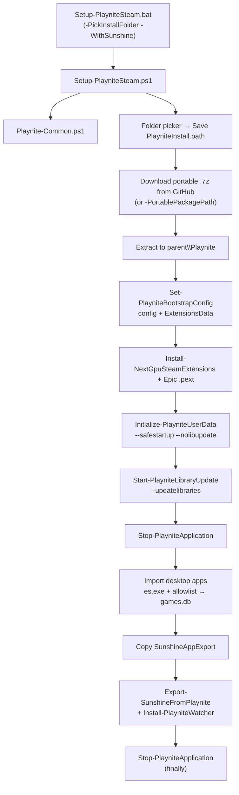

# Playnite End-to-End Setup (Portable)

Automated **portable Playnite** install with **Steam/Epic disk scan** (installed games only, no login). The default batch path also imports **desktop apps** from an allowlist (Adobe, etc.) and optionally exports to **Sunshine/Moonlight**. No Playnite UI is required for the default path.

---

## Quick start (fully automatic)

1. Install **7-Zip** or **WinRAR/UnRAR** (for Playnite `.7z` portable archives).
2. Clone or extract this repo to a **fixed folder** (do not move it after setup).
3. Install **Steam** and/or **Epic** with games on disk (for import).
4. For desktop allowlist import: install [voidtools Everything](https://www.voidtools.com/) and index data drives (e.g. `Z:\Adobe`). See [`tools/everything/README.md`](../tools/everything/README.md).
5. Copy and edit the allowlist (optional but required for desktop apps):

```powershell
Copy-Item config\playnite\desktop-apps.allowlist.json.template config\playnite\desktop-apps.allowlist.json
```

6. Double-click:

```bat
Setup-PlayniteSteam.bat
```

The batch file runs **`Setup-PlayniteSteam.ps1 -PickInstallFolder -WithSunshine`**, which includes Steam/Epic import, desktop allowlist import, Sunshine export, and PlayNiteWatcher install.

7. In the **folder picker**, choose a parent folder (e.g. `D:\Games`). Playnite installs to **`D:\Games\Playnite`**.
8. When prompted, choose a **drive or folder** for desktop app search (e.g. `Z:\` or `Z:\Adobe`), or **all non-system drives**.
9. Wait until the window finishes. Check **`Setup-PlayniteSteam.log`** in the repo if anything fails.

**Done.** Playnite is installed, Steam/Epic libraries are updated, desktop apps are synced into `library\games.db`, Sunshine export runs when `-WithSunshine` is used, and the Moonlight app list is pushed to AWS from `domain.txt`. Path is saved in **`PlayniteInstall.path`** in this repo.

### Playnite-only (no desktop import / Sunshine)

```powershell
.\Setup-PlayniteSteam.ps1 -PickInstallFolder -SkipDesktopImport
```

### Re-import after new games

```powershell
.\Update-PlayniteLibraries.ps1
```

(or `Update-PlayniteLibraries.bat`)

### Re-import desktop apps only

```powershell
Setup-PlayniteSteam.bat -SkipInstall -DesktopImportScanMode AllDrives
```

Or headless:

```powershell
.\Import-PlayniteDesktopApps.ps1 -InstallDir 'Z:\Playnite' -Headless -DesktopImportScanMode AllDrives
```

Replace `Z:\Playnite` with your install path from **`PlayniteInstall.path`**.

---

## Automatic install flow (what runs)

`Setup-PlayniteSteam.bat` launches PowerShell with `-PickInstallFolder -WithSunshine`. All work is in **`Setup-PlayniteSteam.ps1`**, which dot-sources **`Playnite-Common.ps1`**.



### Default steps (with `-WithSunshine`)

Step numbers in **`Setup-PlayniteSteam.log`** depend on flags (`-FullSetup`, `-SkipSunshineExtension`, `-SkipDesktopImport`). Core flow with the default batch file:

| Step | What happens |
|------|----------------|
| 1 | **Resolve install folder** — folder picker; writes **`PlayniteInstall.path`** (parent or `...\Playnite`). |
| 2 | **Install portable** — download latest release from [Playnite GitHub](https://github.com/JosefNemec/Playnite/releases) into `<install>\Download`, extract to `<parent>\Playnite`. Optional **legacy cleanup** (junctions, `unins000.*`). |
| 3 | **Disk-scan config** — merge templates into `config.json` and Steam/Epic **`ExtensionsData`** configs (`ImportInstalledGames: true`, `ConnectAccount: false`). Sets `FirstTimeWizardComplete: true` (skips wizard UI). |
| 4 | **Install library extensions** — copy **NextGPU Steam** from repo `SteamExtensions/build/` (`SteamLibrary_NextGPU` + `NextGPUBypassGuard`); download official Epic **`.pext`** only (see `config/playnite/builtin-library-extensions.json`). Removes legacy `SteamLibrary_Builtin` if present. |
| 5 | **Bootstrap library DB** — short launch with `--safestartup --nolibupdate` to create `library\games.db` (no Steam/Epic import yet). |
| 6 | **Update libraries** — launch `--updatelibraries`, poll **`playnite.log`** until import completes (typically **10–30 s** for a few games; **up to 15 min** cap via `-MaxWaitMinutes`). |
| 7 | **Stop Playnite** — graceful `--shutdown` if running, then wait for exit (does **not** launch Playnite when already stopped). |
| 8 | **Import desktop apps** — scan drive/folder or all non-system drives; **`es.exe`** finds allowlisted `.exe` names; writes launch paths into **`library\games.db`**. Skipped with `-SkipDesktopImport` or without `-WithSunshine`. |
| 9 | **SunshineAppExport** — copy `SunshineAppExport/` into `<install>\Extensions\SunshineAppExport` (`-SkipSunshineExtension` to skip). |
| 10 | **Sunshine export + watcher** — `Export-SunshineFromPlaynite.ps1` + `Install-PlayniteWatcher.ps1` (`-SkipSunshineExport` / `-SkipWatcherInstall` to skip parts). |
| 11 | **Stop Playnite** — final cleanup in `finally` so `games.db` is not locked. |

Playnite is **not** left open at the end unless you pass **`-LaunchPlaynite`**.

#### How library-update wait works

`Wait-PlayniteLibraryImportInLog` in **`Playnite-Common.ps1`** reads **`playnite.log`** every 2 seconds. It parses Playnite timestamps **with milliseconds** (`28-05 03:38:01.298`). It finishes when it sees lines such as:

- `Setting Sorting Name for N new games` (import + metadata done)
- `Steam library import finished` / `Epic library import finished`
- `Finished Library Install Size scan` after `Importing games from … plugin` (zero new games)

If setup still sits for the full **15 minutes**, check the log for `Library import complete` vs `No Steam/Epic import activity` — usually a stale script build or `playnite.log` not updating.

#### Desktop import log lines

Success in **`Setup-PlayniteSteam.log`**:

```text
Desktop allowlist import: scanned 1 root(s), added 16, updated 0
```

Each resolved app also logs `Resolved: Acrobat.exe -> Z:\Adobe\...\Acrobat.exe`.

If **`added 0`**: Everything IPC failed (`es.exe` exit **8**), allowlist file missing, or exes not indexed. See [Desktop apps troubleshooting](#desktop-apps-troubleshooting).

### Optional: `-FullSetup`

Inserts an extra step **before** config:

- **Detect Steam** install path (registry / common folders) and log it.

After library update it also:

- Prints **`library/games.db`** stats (game counts; uses sqlite if available).

Does **not** add Sunshine export/watcher unless you also pass **`-WithSunshine`**. Still copies **`SunshineAppExport`** unless **`-SkipSunshineExtension`**.

```powershell
.\Setup-PlayniteSteam.ps1 -PickInstallFolder -FullSetup -WithSunshine
```

### Logs and saved path

| File | Purpose |
|------|---------|
| `Setup-PlayniteSteam.log` | Full setup trace |
| `PlayniteInstall.path` | One line: install root (from folder picker; gitignored) |
| `Update-PlayniteLibraries.log` | Re-scan trace |

---

## Folder layout after setup

**Repo (this project)** — keep stable:

```text
PlayNiteWatcher\
  Setup-PlayniteSteam.bat          ← run this (includes -WithSunshine)
  Setup-PlayniteSteam.ps1
  Playnite-Common.ps1
  Import-PlayniteDesktopApps.ps1
  Update-PlayniteLibraries.ps1
  Install-SteamExtensions.ps1
  SteamExtensions\build\              ← prebuilt SteamLibrary_NextGPU + NextGPUBypassGuard
  PlayniteInstall.path             ← created by setup (your path)
  config\playnite\
    config.template.json
    steam-config.template.json
    epic-config.template.json
    builtin-library-extensions.json
    desktop-apps.allowlist.json.template
    desktop-apps.allowlist.json    ← copy from template; edit exe/nameId/title
  tools\
    everything\es.exe              ← downloaded by setup when needed
    sqlite\sqlite3.exe             ← downloaded on first Sunshine export if needed
  Setup-PlayniteSteam.log
```

**Playnite install** — path from picker, always ends with `\Playnite`:

```text
<your-parent>\Playnite\
  Playnite.DesktopApp.exe          ← all users launch this
  Playnite.FullscreenApp.exe
  LiteDB.dll                       ← used by Playnite and headless desktop import
  config.json
  library\
    games.db                       ← LiteDB; Steam/Epic + manual desktop games
    games.db.backup                ← created if Playnite attempts repair
  playnite.log
  Download\                        ← setup downloads .7z here
  Extensions\
    SteamLibrary_NextGPU\            ← NextGPU fork (same Steam PluginId as official)
    NextGPUBypassGuard\              ← restores bypass .lnk paths after library import
    EpicGamesLibrary_Builtin\
    SunshineAppExport\
  ExtensionsData\
    NextGPU\bypass-bindings.json     ← published by bypass sync (read by NextGPUBypassGuard)
    CB91DFC9-B977-43BF-8E70-55F46E410FAB\config.json   ← Steam plugin settings
    00000002-DBD1-46C6-B5D0-B1BA559D10E4\config.json   ← Epic plugin settings
```

Portable data lives **inside** the install folder (not `%AppData%\Playnite`), so every Windows account can use the same library by launching the same `Playnite.DesktopApp.exe`.

---

## Repository script structure

### Playnite setup (use these)

| Script | Role |
|--------|------|
| **`Setup-PlayniteSteam.bat`** | Entry point: `-PickInstallFolder -WithSunshine` (+ any extra args you pass) |
| **`Setup-PlayniteSteam.ps1`** | Main orchestrator: download, extract, config, `.pext` install, bootstrap, library update, desktop import, Sunshine |
| **`Playnite-Common.ps1`** | Shared helpers: paths, extension install, `playnite.log` wait, LiteDB desktop sync, Everything |
| **`Update-PlayniteLibraries.ps1`** | Ensure NextGPU Steam + Epic extensions, re-run `--updatelibraries`, re-apply bypass shortcuts in `finally` |
| **`Update-PlayniteLibraries.bat`** | Same as above via batch wrapper |
| **`Install-SteamExtensions.ps1`** | Manual repair: copy `SteamExtensions/build/` into `<install>\Extensions\` |
| **`Import-PlayniteDesktopApps.ps1`** | Desktop allowlist import only (interactive or `-Headless`) |
| **`config/playnite/*.template.json`** | Defaults merged into Playnite/Steam/Epic configs during setup |

**`Playnite-Common.ps1`** (dot-sourced, not run alone) provides:

- `Resolve-PlayniteInstallPathFromConfig` / `Read-SavedPlayniteInstallPath` — read **`PlayniteInstall.path`**
- `Resolve-PlayniteInstallDir` — uses only the saved/override path (no `%LocalAppData%\Playnite` fallback)
- `Expand-PlayniteInstallDirectory` — parent folder → `...\Playnite`
- `Get-PlayniteDesktopExe`, `Get-PlayniteDataDirectory`, `Get-PlayniteLibraryGamesDbPath`
- `Install-NextGpuSteamExtensions` — copy repo `SteamLibrary_NextGPU` + `NextGPUBypassGuard` (no official Steam download)
- `Install-PlayniteBuiltinLibraryExtensions` — calls NextGPU Steam install, then downloads/installs Epic `.pext` only
- `Wait-PlayniteLibraryImportInLog` — poll **`playnite.log`** for import completion
- `Stop-PlayniteApplication` — graceful shutdown when running; never starts Playnite just to send `--shutdown`
- `Invoke-HeadlessDesktopAppImport` / `Sync-PlayniteDesktopAppsToAllowlist` — find exes, write **`games.db`**
- `Remove-PlayniteManualGamesFromLiteDb` — recovery: remove bad manual desktop entries
- `Ensure-EverythingReady`, `Find-AllowlistedExesViaEverything` — **`es.exe`** search (Everything must be running)
- `Get-PlayniteGameRecordsFromLiteDb`, `Get-ExportablePlayniteGames` — read Playnite 10 **LiteDB** via `LiteDB.dll` from the install folder

### Sunshine / Moonlight (optional, included with default batch)

| Script | Role |
|--------|------|
| `Export-SunshineFromPlaynite.ps1` | Headless export: Steam/Epic + **desktop allowlist** → Sunshine `apps.json` |
| `SunshineExport-Core.ps1` | Shared export logic (CRC AppIDs, publish to config) |
| `Install-PlayniteWatcher.ps1` | Headless watcher hooks + `PrepCommandInstaller.ps1` |
| `Installer-ExportAndInstall.bat` | Export then install watcher (no GUI) |
| `SunshineAppExport/` | Playnite UI extension (legacy manual export in app) |
| `Add-SteamGames.ps1` | Legacy standalone Sunshine tooling (not default) |

Extension copy is enabled by default during setup (use **`-SkipSunshineExtension`** to disable). Sunshine export/watcher runs when **`-WithSunshine`** is passed (default in the batch file).

---

## Desktop apps (allowlist + Everything + Playnite + Sunshine)

Use one config file for **Playnite import** and **Sunshine export**:

Copy `config\playnite\desktop-apps.allowlist.json.template` → `config\playnite\desktop-apps.allowlist.json` and edit:

| Field | Purpose |
|-------|---------|
| `exe` | Executable file name only (`Photoshop.exe`) — search key + library match |
| `nameId` | Sunshine / Moonlight app name (like Steam AppID `730`) — written to `apps.json` → `name` |
| `title` | Playnite display name (not the Sunshine name) |

Example:

```json
{ "exe": "Photoshop.exe", "nameId": "6", "title": "Adobe Photoshop" }
```

The allowlist stores **only the `.exe` filename**, not `Z:\...\Photoshop.exe`. Adobe and similar apps live in deep folders (e.g. `Z:\Adobe\Adobe Photoshop 2024\Photoshop.exe`). **voidtools Everything (`es.exe`)** finds that real path from the index; Playnite then stores the full path in `library\games.db`. You do not need to maintain install paths in JSON.

### What appears in Playnite after import

| Source | In Playnite UI |
|--------|----------------|
| Steam disk scan | Installed Steam games (e.g. CS2, GTA V) with Steam metadata |
| Epic disk scan | Installed Epic games |
| Desktop allowlist | Up to **16 custom games** (`title` from allowlist), `PluginId` = manual (`00000000-…`), generic covers unless you add metadata |

**`nameId`** is for Sunshine/Moonlight only — not shown as the Playnite game name.

### How desktop import writes `games.db`

Headless import opens **`library\games.db`** with Playnite’s **LiteDB 4** format (`Mode=Exclusive`, same as Playnite). It:

1. Stops any running Playnite process.
2. Finds each allowlisted `.exe` via **`es.exe`** (or directory walk with `-SkipEverythingInstall`).
3. Inserts or updates manual game records with launch actions compatible with Playnite’s mapper (cloned from an existing Steam/Epic game when present).
4. Stops Playnite again so the DB is not locked for the next launch.

Do **not** edit `games.db` with raw LiteDB 5 tools or scripts outside this repo — incompatible BSON breaks Playnite startup.

### Automatic (default batch: `-WithSunshine`)

1. Installs Playnite + Steam/Epic disk import  
2. **Imports desktop apps** — dialog: **choose drive or folder** (e.g. `Z:\` or `Z:\Adobe`) or **all non-system drives** (skips system/boot, usually `C:\`). Uses **`es.exe`** against a running [Everything](https://www.voidtools.com/) instance. Setup downloads `es.exe` to `tools\everything\` and starts **`Everything.exe -startup`** if IPC is not ready.  
3. Exports Steam/Epic + desktop to Sunshine (`nameId` = Moonlight app name)  
4. Installs PlayNiteWatcher  

**Flags:**

| Flag | Effect |
|------|--------|
| `-SkipDesktopImport` | Skip step 2 |
| `-SkipEverythingInstall` | Directory walk only (no `es.exe`) |
| `-DesktopImportScanMode PickPath -DesktopScanPath "Z:\Adobe"` | Non-interactive single root |
| `-DesktopImportScanMode AllDrives` | All fixed/removable drives except system/boot |
| `-DesktopImportScanMode Prompt` | Scan scope dialog (default during setup) |

**Re-run desktop import only:**

```powershell
Setup-PlayniteSteam.bat -SkipInstall -DesktopImportScanMode AllDrives
```

```powershell
.\Import-PlayniteDesktopApps.ps1 -InstallDir 'Z:\Playnite' -Headless -DesktopImportScanMode AllDrives
```

(`PickFolder` is an alias for `PickPath`.)

### Manual import (Playnite UI scan)

```powershell
.\Import-PlayniteDesktopApps.ps1
```

Use when apps live outside default scan roots: pick folder, **Add game → Scan automatically**, press Enter to sync allowlist paths into the library.

### Export + watcher only

```powershell
.\Export-SunshineFromPlaynite.ps1
.\Install-PlayniteWatcher.ps1
```

Or **`Installer-ExportAndInstall.bat`**.

Desktop entries use the same Sunshine shape as Steam: `name` = your `nameId`, `playnite-id`, `prep-cmd` → `eventLogs.ps1`, launch `Playnite.DesktopApp.exe --start <guid>` in `resolved-appids.txt` under a **Desktop:** section.

Skip desktop export: `.\Export-SunshineFromPlaynite.ps1 -SkipDesktopApps`

### Desktop apps troubleshooting

| Symptom | What to check |
|---------|----------------|
| `added 0` in setup log | Everything not running (`es.exe` exit **8**); index missing drive (e.g. `Z:\`); allowlist file missing; see `Everything debug:` lines in log |
| `Desktop import aborted` | Start Everything (tray or service), re-run import |
| Exe found but not under chosen root | Pick a broader root (`Z:\` not `Z:\Adobe\subfolder` if path differs) or use `AllDrives` |
| Playnite “DB damaged” / `InvalidCastException` | Old script wrote invalid manual BSON — see [games.db recovery](#gamesdb-recovery) below |
| Playnite “file is being used by another process” | Another `Playnite.DesktopApp.exe` still open — stop it before import or launch |

Everything details: [`tools/everything/README.md`](../tools/everything/README.md).

### Bypass shortcuts (RunAsTool + Playnite)

Admin-only setup for elevated launches via **RunAsTool** shortcuts in a **Game Shortcuts** folder. Playnite `games.db` stores the `.lnk` path; Moonlight still uses Playnite `--start <guid>`.

Seed assets live in [`templates/bypass/`](../templates/bypass/) (`RunAsTool.rnt` + `Game Shortcuts/*.lnk`). Refresh that folder from a reference machine when games change (see README there).

1. RunAsTool is **auto-downloaded and installed** during bypass setup (`Install-RunAsTool.ps1`). Maintenance launch: `.\Launch-RunAsTool.ps1`.

2. **Setup Bypass (Automated)** — primary path (NextGPU Playnite page or):

   ```powershell
   .\Setup-PlayniteBypassAutomated.ps1
   ```

   - Folder picker for parent → `{parent}\Game Shortcuts`
   - Copies bundled `.lnk` shortcuts from `templates/bypass/Game Shortcuts`
   - **One** `Get-Credential` prompt for `NextGPU-Authority`, then silent CLI import of `templates/bypass/RunAsTool.rnt` (`/R` reset + `/I=`)
   - Saves `bypass-shortcuts.json`
   - Does **not** open RunAsTool GUI during import

3. **Launch RunAsTool** (optional — verify imported apps):

   ```powershell
   .\Sync-PlayniteBypassShortcuts.ps1 -RunAsToolOnly
   ```

4. **Review and sync** (scan Game Shortcuts folder):

   ```powershell
   .\Sync-PlayniteBypassShortcuts.ps1 -Interactive
   ```

   Scans all `.lnk` files in Game Shortcuts, opens a review grid (display name, **Launch** mode, helper/game/script paths, **In allowlist** vs **Outside allowlist**, auto-match hints), then updates Playnite `games.db` and the desktop allowlist as needed. **Outside allowlist** is for Steam/Epic games (play path only). **In allowlist** is for desktop/manual apps (allowlist + Sunshine `nameId`). New desktop apps prompt for allowlist slot details.

   **Helper column:** If a title needs an extra executable alongside the RunAsTool `.lnk` (e.g. Garena), enter the path in **Helper** and sync. Review and Sync auto-generates `{DisplayName}.ps1` + `{DisplayName}.cmd`. Empty **Helper** still gets a thin `{DisplayName}.cmd` that launches the `.lnk` via `start` (Playnite cannot run `.lnk` paths directly).

5. **Re-sync only** (existing shortcuts and launcher bindings with known Playnite/allowlist matches, no UI):

   ```powershell
   .\Sync-PlayniteBypassShortcuts.ps1 -SyncOnly
   ```

6. Legacy manual folder-only setup (no seed copy / no `.rnt` import):

   ```powershell
   .\Sync-PlayniteBypassShortcuts.ps1 -PickParentFolder
   ```

7. Standalone bulk RunAsTool import: `.\Invoke-RunAsToolImportRnt.ps1 -RntPath path\to\backup.rnt -ResetList`

8. Export to Sunshine when prompted after review/sync so new `nameId` entries appear in Moonlight.

Advanced/unsupported: `Invoke-RunAsToolGuiAutomation.ps1` and `Invoke-RunAsToolBypassShortcut.ps1` remain in the repo but are not used by the default workflow.

Desktop import **does not overwrite** games with active bypass bindings; bypass sync re-applies after desktop import and after **`Update-PlayniteLibraries.ps1`**.

**Steam library games (Outside allowlist):** Playnite’s Steam plugin can revert play paths on `--updatelibraries`. NextGPU mitigates this with:

1. **`NextGPUBypassGuard`** — reads `<install>\ExtensionsData\NextGPU\bypass-bindings.json` and restores play actions (`.lnk` or `.cmd` launcher paths) on startup and after library import.
2. **PowerShell fallback** — `Update-PlayniteLibraries.ps1` calls `Invoke-ReapplyPlayniteBypassShortcuts` in its `finally` block.
3. **`-SyncOnly`** — uses stored `syncType` on each binding so Outside-allowlist games (e.g. Wuthering Waves) target the Steam row, not a manual duplicate.

After interactive sync, bindings are published to `bypass-bindings.json` automatically. Existing hosts: run `.\Sync-PlayniteBypassShortcuts.ps1 -SyncOnly` once to publish.

**Uninstall:** `.\Uninstall-PlayniteBypass.ps1` removes RunAsTool and Game Shortcuts bypass config; **keeps** the portable Playnite folder and `games.db` by default. Use `-RemovePlayniteInstall` to also delete Playnite (full machine uninstall via `Uninstall-NextGPU.ps1` passes this flag).

Repair Steam extensions manually: `.\Install-SteamExtensions.ps1`

### Bypass vs Steam conflict matrix

| ID | Symptom | Fix |
|----|---------|-----|
| **C1** | Steam `--updatelibraries` reverts bypass `.lnk` | `NextGPUBypassGuard` + PS re-apply after `Update-PlayniteLibraries.ps1` |
| **C2** | Setup downloads official `SteamLibrary_Builtin_2_40.pext` | Repo ships `SteamLibrary_NextGPU` only; Epic still from JosefNemec |
| **C3** | Library re-scan does not re-apply bypass | `Update-PlayniteLibraries.ps1` `finally` → `Invoke-ReapplyPlayniteBypassShortcuts` |
| **C4** | `-SyncOnly` updates wrong Playnite row | Bindings store `syncType`; Outside allowlist passes `-OutsideAllowlist` |
| **C7** | Sunshine export skips Genshin/Naraka after bypass | Export matches allowlist games via bypass binding `playniteId` / `launchPath` before exe leaf |

Details: [`SteamExtensions/README.md`](../SteamExtensions/README.md), [`tools/runastool/README.md`](../tools/runastool/README.md). Log: `Sync-PlayniteBypassShortcuts.log`.

### games.db recovery

Setup stops Playnite after library update and desktop import. If Playnite shows **“Failed to open library database”** or **“DB file … is most likely damaged”**:

1. Stop all Playnite processes.
2. Remove bad manual desktop entries (Steam/Epic games are kept):

```powershell
Stop-Process -Name Playnite.DesktopApp -Force -ErrorAction SilentlyContinue
cd C:\path\to\PlayNiteWatcher
. .\Playnite-Common.ps1
Remove-PlayniteManualGamesFromLiteDb -InstallDir 'Z:\Playnite'
```

3. Launch Playnite once — Steam/Epic entries should load.
4. Re-run desktop import with the current repo scripts:

```powershell
Setup-PlayniteSteam.bat -SkipInstall -DesktopImportScanMode AllDrives
```

If Playnite still cannot open the DB, restore **`library\games.db`** from **`library\games.db.backup`** (Playnite creates this during repair attempts) or delete `library\games.db*` and run **`Update-PlayniteLibraries.ps1`** to rebuild Steam/Epic, then desktop import again.

---

## Prerequisites

- Windows host machine.
- **7-Zip** or **WinRAR/UnRAR** (for Playnite portable `.7z` extraction).
- **Steam** and/or **Epic** with games installed on disk (for import without login).
- **Everything** (recommended for desktop allowlist import on deep paths like `Z:\Adobe\...`).
- Internet on first setup (Playnite portable `.7z` + Epic library `.pext` unless cached under `<install>\Download`). **Steam** is shipped in-repo (`SteamExtensions/build/`); setup does **not** download `SteamLibrary_Builtin_2_40.pext`.
- This repository in a **stable path** (do not move after install).

---

## PowerShell equivalents

Same automation as the batch file:

```powershell
.\Setup-PlayniteSteam.ps1 -PickInstallFolder -WithSunshine
```

Playnite only (no desktop import / Sunshine):

```powershell
.\Setup-PlayniteSteam.ps1 -PickInstallFolder -SkipDesktopImport
```

Local archive instead of GitHub download:

```powershell
.\Setup-PlayniteSteam.ps1 -PickInstallFolder -WithSunshine -PortablePackagePath "D:\Downloads\10.55.7z"
```

Useful flags:

| Flag | Effect |
|------|--------|
| `-SkipInstall` | Playnite already extracted; re-run config + import only |
| `-SkipLibraryUpdate` | Skip `--updatelibraries` |
| `-LaunchPlaynite` | Open desktop UI when finished |
| `-MaxWaitMinutes 30` | Raise the **maximum** wait for `playnite.log` completion (default **15**) |
| `-SkipLegacyCleanup` | Keep old AppData junction / `unins000.*` |
| `-FullSetup` | Steam detect + `library/games.db` stats |
| `-SkipSunshineExtension` | Skip copying `SunshineAppExport/` into Playnite Extensions |
| `-WithSunshine` | Desktop import + Sunshine export + PlayNiteWatcher (default in `.bat`) |
| `-SkipDesktopImport` | Skip desktop allowlist import |
| `-SkipSunshineExport` / `-SkipWatcherInstall` | Partial Sunshine pipeline |
| `-DesktopImportScanMode PickPath` | Scan one drive or folder (`-DesktopScanPath` skips picker) |
| `-DesktopImportScanMode AllDrives` | Scan all fixed/removable drives except system/boot |
| `-SkipEverythingInstall` | Directory walk only (no `es.exe`) |

**`-PlayniteInstallDir`** is for automation without the picker. Normal use: folder picker + **`PlayniteInstall.path`**.

---

## Re-scan libraries (after new games)

Setup already imports once. When you install more Steam/Epic games on disk:

```powershell
.\Update-PlayniteLibraries.ps1
```

Uses **`PlayniteInstall.path`** automatically. Ensures **NextGPU Steam** + Epic extensions are present, runs `--updatelibraries`, re-applies bypass shortcuts, and uses the same **`playnite.log`** wait (default cap **20** minutes). Pass **`-SkipMetadata`** to avoid a long metadata pass on large libraries. Or use **Update Game Library → Update all** in Playnite.

Steam/Epic **login** is optional — only needed for games you own but have not installed on this PC.

---

## Multi-user use

- Every account launches **`Playnite.DesktopApp.exe`** from the path in **`PlayniteInstall.path`**.
- Do **not** use `%LocalAppData%\Playnite\Playnite.DesktopApp.exe` for the shared library.
- Only one user should run Playnite at a time (avoids `library/games.db` locks).

---

## Legacy cleanup

Unless **`-SkipLegacyCleanup`**:

- Removes obsolete `PlayniteProfile.path` in the repo.
- Removes AppData Playnite junction if present.
- Removes `unins000.exe` / `unins000.dat` from the portable folder.

**Migrating an old library:** close Playnite, copy data into your portable install folder, ensure `config.json` has `"DatabasePath": "library"`.

---

## Validation checklist (Playnite)

- [ ] `<install>\Playnite.DesktopApp.exe` exists
- [ ] `<install>\config.json` exists
- [ ] `<install>\library\games.db` exists and has games after import
- [ ] `PlayniteInstall.path` in repo matches your install folder
- [ ] `<install>\Extensions\SteamLibrary_NextGPU`, `\NextGPUBypassGuard`, and `\EpicGamesLibrary_Builtin` exist
- [ ] `<install>\Extensions\SteamLibrary_Builtin` is **not** present (migrated away on setup/update)
- [ ] `config\playnite\desktop-apps.allowlist.json` exists (if using desktop import)
- [ ] `Setup-PlayniteSteam.log` shows `Library import complete` and `added N` for desktop import (N > 0 when apps are indexed)
- [ ] Launching Playnite shows Steam/Epic games plus allowlisted desktop titles (no “damaged database” error)

---

## Troubleshooting (Playnite setup)

| Symptom | What to check |
|---------|----------------|
| Picker then immediate failure | Target drive not mounted / no permission |
| Extraction fails | Install 7-Zip or WinRAR/UnRAR |
| No games in library | Steam/Epic not installed, **`Extensions\SteamLibrary_NextGPU`** / **`EpicGamesLibrary_Builtin`** missing, or no `appmanifest` / `LauncherInstalled.dat` on disk; re-run setup or `Update-PlayniteLibraries.ps1` |
| Steam bypass reverts after library update | Run `Sync-PlayniteBypassShortcuts.ps1 -SyncOnly`; confirm `ExtensionsData\NextGPU\bypass-bindings.json` exists and `NextGPUBypassGuard` is installed |
| Setup log still downloads Steam `.pext` | Update repo; Steam was removed from `builtin-library-extensions.json` |
| Import works but setup waits ~15 min | Old build ignored `playnite.log` milliseconds; update repo. Success lines: `Importing games from Steam plugin`, `Setting Sorting Name for N new games` |
| Timeout on import | Check `playnite.log` for import errors; increase `-MaxWaitMinutes`; confirm extensions loaded (`ExtensionFactory:Loaded plugin: Steam library integration`) |
| Many `--shutdown` lines in `playnite.log` | Fixed in current scripts — old `Stop-PlayniteApplication` launched Playnite when already stopped; update repo |
| DB damaged / InvalidCastException | [games.db recovery](#gamesdb-recovery) |
| DB locked on launch | `Stop-Process -Name Playnite.DesktopApp -Force`; ensure setup finished (final stop in log) |
| Another user sees empty library | Wrong exe path — must use path in `PlayniteInstall.path` |
| Missing template / extension config | Ensure `config\playnite\` has the three `*.template.json` files and **`builtin-library-extensions.json`** |

---

## 8) Sunshine / Moonlight / PlayNiteWatcher (optional)

Included by default when using **`Setup-PlayniteSteam.bat`** (`-WithSunshine`). Requires Sunshine, and `eventLogs.ps1` under `C:\Program Files\Sunshine\scripts\` for the watcher path.

**During setup** (elevated if writing to Program Files):

```powershell
.\Setup-PlayniteSteam.ps1 -PickInstallFolder -WithSunshine -SkipInstall
```

**Or separately:**

```powershell
.\Export-SunshineFromPlaynite.ps1
.\Install-PlayniteWatcher.ps1
```

First export may download **sqlite3** to `tools\sqlite\`. Run elevated once for a single UAC when copying to `C:\Program Files\Sunshine\config`.

**Export outputs** in Sunshine config folder:

- `apps.json`
- `resolved-appids.json`
- `resolved-appids.txt`

Example line in `resolved-appids.txt`:

```text
<crcAppId>: &"<install>\Playnite.DesktopApp.exe" --start <playniteGameGuid>
```

**UI extension copy (default):** setup already copies `SunshineAppExport/` into Playnite. Use `-SkipSunshineExtension` only if you want to disable it.

**Legacy:** `Installer.bat` / `WatcherUI.ps1` — same watcher, manual UI.

### Sunshine troubleshooting

| Symptom | What to check |
|---------|----------------|
| Export failed (LiteDB) | `LiteDB.dll` must exist next to `Playnite.DesktopApp.exe`; run library update first so `library\games.db` exists |
| No games in export | Run `Update-PlayniteLibraries.ps1` first; `library/games.db` must contain Steam/Epic entries |
| Desktop apps missing from export | Re-run desktop import; export reads allowlist matches from `games.db` |
| Moonlight stream does not auto-close | PlayNiteWatcher / `eventLogs.ps1` / prep-cmd install |

---

## Manual Playnite UI (optional)

Only if you want the desktop app or in-app extension:

```powershell
.\Setup-PlayniteSteam.ps1 -PickInstallFolder -LaunchPlaynite
```

Or launch `Playnite.DesktopApp.exe` from your install folder directly.

---

## Legacy / runtime (not part of default Playnite install)

| Script | Role |
|--------|------|
| `WatcherUI.ps1` + `Installer.bat` | GUI installer for PlayNiteWatcher |
| `PlayniteWatcher.ps1` | Sunshine prep-cmd / game watcher |
| `PrepCommandInstaller.ps1` | Writes Sunshine global prep commands |
| `PlayniteWatcher-EndScript.ps1` | End-of-stream cleanup helper |
