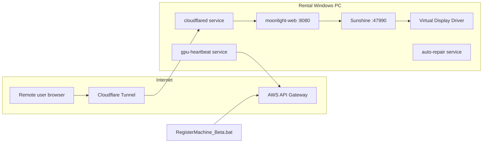

# nextGPU Core Scripts — GPU Rental Machine Setup

Windows automation for provisioning a **remote GPU gaming / rental workstation**: Sunshine streaming host, Moonlight Web client, Cloudflare Tunnel exposure, AWS backend registration, and ongoing health monitoring via Windows services.

The **primary entry point** is `RegisterMachine_Beta.bat`. Run it once on a fresh machine (as Administrator). It installs drivers, streaming stack, tunnel, registers the host, and installs background services.

---

## Quick start

1. Clone or copy this folder to the target PC (e.g. `Downloads\nextGPU-corescripts`).
2. **Right-click** `RegisterMachine_Beta.bat` → **Run as administrator**  
   (The script auto-elevates if needed and reopens an elevated console.)
3. Enter the prompts when asked (see [Required inputs](#required-inputs)).
4. Wait for the full install (downloads, pairing, tunnel creation, API registration).
5. **Reboot manually** when convenient — drivers, display paths, and account renames apply more reliably after restart.

---

## Required inputs

During setup, `RegisterMachine_Beta.bat` asks for:

| Prompt | Purpose |
|--------|---------|
| **Cloudflare API Token** | Create/manage tunnels and DNS for `next-gpu.com` |
| **Cloudflare Account ID** | Account that owns the tunnel |
| **API Key** | `x-api-key` header for the register-machine Lambda |
| **Computer Name** | Display name for the rental node (e.g. `GPU-RENTAL-01`); also used in Moonlight `config.json` (lowercased) |
| **Original Price** | Listing price sent to the backend (e.g. `10.99`) |
| **Vendor ID** *(optional)* | If set, sent as `vendor_id` in the `registerMachine` JSON payload; press Enter to omit |
| **Admin account username** | Existing local admin to rename → `NextGPU-Authority` |

After entry, a summary is shown; confirm with **Y** to continue or re-enter.

---

## Architecture overview



| Component | Role |
|-----------|------|
| **Sunshine** | GameStream-compatible host; encodes and streams the desktop/games |
| **Moonlight Web** | Browser client + local API on `http://127.0.0.1:8080` |
| **cloudflared** | Cloudflare Tunnel → public HTTPS hostname → local Moonlight |
| **NSSM** | Runs Moonlight, heartbeat, and auto-repair as Windows services |
| **VDD + VAD** | Virtual display and audio so headless/streaming works without a physical monitor |
| **ViGEmBus** | Virtual gamepad driver for controller input over stream |
| **AWS APIs** | `registerMachine` (one-time) and `updateStatus` (heartbeat) |

**Static defaults** (inside the batch file):

- Local ingress target: `http://127.0.0.1:8080`
- Public DNS zone: `next-gpu.com`
- Sunshine credentials set during install: `bluefml1` / `letmeinpls`

---

## `RegisterMachine_Beta.bat` — full setup flow

The script resolves its own directory (`SCRIPT_DIR`) so all paths are relative to the repo folder. Steps below follow execution order.

### Phase 0 — Privileges and configuration

1. **Administrator check** — Uses `fltmc`; if not admin, relaunches via PowerShell `Start-Process ... -Verb RunAs` with marker `__elevated__`.
2. **Interactive configuration** — Collects Cloudflare token, account ID, API key, computer name, price, and admin username; normalizes computer name to lowercase for Moonlight config substitution (`{{computer_name}}`).
3. **WMI / CIM probe** — Runs `Ensure-WmiSupport.ps1` (log: `wmi-probe.log`). On failure, setup exits. If WMIC is missing, inventory still uses PowerShell CIM.

### Phase 1 — Virtual display and audio (pre-streaming)

4. **VDD + VAD** — `silent-install-vdd-vad.ps1`  
   - Downloads NefCon + Virtual Display Driver + Virtual Audio Driver from GitHub.  
   - Staging: `VDD-VAD-Install\`, log: `VDD-VAD.log`.  
   - Skipped with a warning if the script is missing.  
5. **Wait 10 seconds** — Allows the virtual display to enumerate before Sunshine configuration.

### Phase 2 — Streaming stack (labeled [1/8]–[4/8] in console)

6. **[1/8] Sunshine**  
   - Removes any existing install under `C:\Program Files\Sunshine`.  
   - Downloads `sunshine.zip` from [nextGPU-sunshine releases](https://github.com/bluefml1/nextGPU-sunshine/releases/latest).  
   - Silent install (`Sunshine.exe /S`), sets credentials, starts Sunshine.  
   - Runs `sunshine\Add-SteamGames.ps1` if present (imports Steam library into Sunshine).  
   - **`setup_sunshine_device_id` subroutine:**  
     - `Get-DisplayDeviceId.ps1` finds the VDD monitor device ID (MTT1337 / libdisplaydevice algorithm).  
     - Writes `output_name` and `dd_configuration_option = ensure_active` into `sunshine.conf`, restarts Sunshine.

7. **[2/8] NSSM**  
   - Downloads `nssm-2.24.zip` (up to 10 attempts, curl/PowerShell rotation).  
   - Extracts to `nssm\nssm-2.24\win64\nssm.exe`.

8. **[3/8] Moonlight Web**  
   - Stops/removes existing `moonlight-web` service if present.  
   - Downloads `moonlight-theme.zip` from [nextGPU-moonlight releases](https://github.com/bluefml1/nextGPU-moonlight/releases/latest) → `moonlight-web\`.  
   - Downloads `server\config.json` and replaces `{{computer_name}}` with the lowercased custom name.  
   - Registers Windows service **`moonlight-web`** via NSSM (auto-start, logs under `moonlight-web\`).

9. **[4/8] Moonlight ↔ Sunshine pairing**  
   - Stops Moonlight, refreshes `server\data.json` from remote template, restarts service.  
   - Logs into Moonlight API (`POST /api/login` with test credentials from template).  
   - Long-poll `POST /api/pair` for a PIN, submits PIN to Sunshine HTTPS API (`https://localhost:47990/api/pin`).  
   - Retries up to **100** times; continues on failure with a warning (non-fatal).

10. **ViGEmBus** — `ViGEmBus.bat inline` (virtual gamepad driver). Warning-only on failure.

### Phase 3 — Cloudflare Tunnel and DNS

11. **[5/8] cloudflared**  
    - Downloads `cloudflared.exe` if missing.  
    - Verifies API token against Cloudflare.  
    - Resolves **Zone ID** for `next-gpu.com`.

12. **[6/8] Network identity**  
    - **Public IP:** `https://api.ipify.org` (fallback `127.0.0.1`).  
    - **Private IP:** first `192.168.1.*` from `ipconfig`.  
    - **DNS_ID:** 8-character uppercase ID from SHA-256(`publicIP,computerName`) mapped to `a-z0-9`.  
    - **DOMAIN:** `{DNS_ID}.next-gpu.com`  
    - **TUNNEL_NAME:** `{DNS_ID}-tunnel`  
    - If tunnel name already exists, appends a random 4-character suffix and rechecks.

13. **[7/8] Tunnel + DNS + service**  
    - Creates Cloudflare tunnel via API; configures ingress: hostname → `http://127.0.0.1:8080`, catch-all 404.  
    - Deletes conflicting DNS record if any; creates proxied **CNAME** → `{tunnel_id}.cfargotunnel.com`.  
    - Removes old `cloudflared` service/registry if present.  
    - Sets machine env `CLOUDFLARE_TUNNEL_TOKEN`, runs `cloudflared service install`, starts **`cloudflared`** service.

### Phase 4 — Inventory, registration, and persistence

14. **System inventory** — `Get-MachineInventory.ps1` (CIM): OS, CPU, RAM (GB), GPU name, `LAST_CHECKIN` timestamp.  
15. **Benchmarks (optional)** — `Get-BenchmarkScores-Silent.ps1` → `bench_mark_cpu`, `bench_mark_gpu` (default `0` if missing).  
16. **Game list for API** — Queries `http://localhost:8080/api/apps?host_id=0` and builds JSON map of game title → stream URL (`https://{DOMAIN}/stream.html?hostId=0&appId=...`).  
17. **Register machine** — `POST` to  
    `https://oa0bwhfkqk.execute-api.ap-southeast-1.amazonaws.com/registerMachine`  
    with header `x-api-key: {API_KEY}` and JSON payload (name, IPs, status, domain, hardware, benchmarks, price, optional `vendor_id`, notes, optional games).  
    - Log: `register_api_log.txt`  
18. **`domain.txt`** — Writes `DOMAIN`, `PUBLIC_IP`, `COMPUTER_NAME` for heartbeat/repair scripts.

### Phase 5 — Background services and scheduled tasks

19. **Heartbeat service** — NSSM installs **`gpu-heartbeat`** running `heartbeat-only.bat` (interval **300 s** by default; see script `INTERVAL_SECONDS`). Logs: `heartbeat.log`, `heartbeat-error.log`.

20. **Auto-repair service** — NSSM installs **`auto-repair`** running `auto-repair.bat` (checks every **60 s**). Monitors cloudflared, Sunshine, moonlight-web, and local HTTP `127.0.0.1:8080`; can reinstall Sunshine/Moonlight on failure. Logs: `auto-repair.log`, `auto-repair-error.log`.

21. **Scheduled tasks (PowerShell)**  
    - `TaskScheduler.ps1` — Registers **EndSession** task (SYSTEM): on Application log event from `LogoffManager` (Event ID 2002), runs Sunshine `endSession.ps1`.  
    - `launchGameTaskScheduler.ps1` — Registers **auto game launch** at user logon → `Z:\launchGame.ps1` (ensure `Z:` and script exist on the image).

### Phase 6 — Wallpaper, accounts, and finish

22. **Wallpaper** — `Setup-Wallpaper.bat inline` → `Set-DesktopWallpaper-Gpo.ps1` (same as standalone; runs **before** account changes).  
23. **Rename admin** — Renames `{ADMIN_ACCOUNT_NAME}` → **`NextGPU-Authority`** (username + full name).  
24. **Create user** — `net user nextGPU /add` (standard user for rental sessions).  
25. **Completion message** — Prompts for **manual reboot** (drivers, display paths, accounts).

---

## Wallpaper only (standalone)

Run as Administrator (double-click `Setup-Wallpaper.bat` or from an elevated prompt):

```bat
Setup-Wallpaper.bat
```

Requires `nextgputobu.jpeg` in the same folder. After success, open **Local Group Policy Editor** → **User Configuration** → **Administrative Templates** → **Desktop** → **Desktop** → **Desktop Wallpaper** — it should show **Enabled**, path `C:\Users\Public\Wallpaper\nextgputobu.jpeg`, style **Fill**. (**Computer Configuration** → same policy stays *Not Configured*; Desktop Wallpaper is a user policy only.)

---

## Ongoing operations (after setup)

### Heartbeat (`heartbeat-only.bat` → service `gpu-heartbeat`)

Runs in a loop (default **every 300 seconds**):

1. Reads `domain.txt` (`DOMAIN`, `PUBLIC_IP`, `COMPUTER_NAME`, optional `STATUS`).
2. Refreshes private IP (`192.168.1.*`).
3. `POST` to `https://oa0bwhfkqk.execute-api.ap-southeast-1.amazonaws.com/updateStatus` with JSON: computer name, public/private IP, status.

To change the interval, edit `INTERVAL_SECONDS` near the top of `heartbeat-only.bat` and restart the service.

### Auto-repair (`auto-repair.bat` → service `auto-repair`)

Every **60 seconds** (after network is reachable):

| Check | Action if failed |
|-------|------------------|
| `cloudflared` service running | `net start cloudflared` |
| `sunshine.exe` process | Start or full reinstall from GitHub zip |
| `moonlight-web` service | `net start` or reinstall Moonlight + NSSM |
| `http://127.0.0.1:8080` returns 200 | Triggers full repair path |

Skips repair when `domain.txt` has `STATUS=updating`.

### Other maintenance scripts (not run by main setup)

| Script | Purpose |
|--------|---------|
| `auto-update.bat` | Separate update flow (not installed as a service by `RegisterMachine_Beta.bat`) |
| `checking-update.bat` | Update check helper |
| `copy.bat` / `extract.bat` / `garena.bat` | Image-specific game/app deployment |
| `InstallVDD-VAD.bat` | Standalone VDD+VAD installer wrapper |

See `Main script to do.txt` for a high-level manual checklist used on some images (VDD, Sunshine/Moonlight, ViGEmBus, disk shrink, game copy, users, reboot).

---

## Windows services created

| Service name | Executable / command | Display name |
|--------------|----------------------|--------------|
| `moonlight-web` | `moonlight-web\web-server.exe` | Moonlight Web Stream |
| `cloudflared` | `cloudflared.exe` (tunnel token) | Cloudflare Tunnel |
| `gpu-heartbeat` | `cmd /c heartbeat-only.bat` | GPU Heartbeat |
| `auto-repair` | `cmd /c auto-repair.bat` | Auto-Repair |

Sunshine runs as a normal process (started at install and by auto-repair), not as an NSSM service in this script.

---

## Key files and logs

```
nextGPU-corescripts/
├── RegisterMachine_Beta.bat      # Main one-time provisioning script
├── heartbeat-only.bat            # Periodic status → AWS
├── auto-repair.bat               # Health checks + reinstall
├── Ensure-WmiSupport.ps1         # WMI/WMIC readiness
├── silent-install-vdd-vad.ps1    # Virtual display + audio
├── Get-MachineInventory.ps1      # OS / CPU / RAM / GPU for API
├── Get-BenchmarkScores-Silent.ps1
├── Get-DisplayDeviceId.ps1       # Sunshine output_name (VDD)
├── ViGEmBus.bat
├── Setup-Wallpaper.bat           # Standalone wallpaper GPO (or called from main script)
├── Set-DesktopWallpaper-Gpo.ps1  # User registry.pol + HKCU wallpaper (Fill)
├── TaskScheduler.ps1             # EndSession scheduled task
├── launchGameTaskScheduler.ps1   # Logon game launch task
├── nextgputobu.jpeg                # Wallpaper source
├── domain.txt                    # Created at end of setup (required for heartbeat)
├── register_api_log.txt          # Registration request/response
├── setup_log_YYYYMMDD.txt        # Setup start timestamp
├── wmi-probe.log
├── VDD-VAD.log
├── moonlight-web/                # Downloaded at setup
├── nssm/                         # NSSM binaries
├── sunshine/                     # Extracted installer + Add-SteamGames.ps1
└── cloudflared.exe               # Downloaded if missing
```

---

## External dependencies (downloaded at runtime)

| Asset | Source |
|-------|--------|
| Sunshine | `github.com/bluefml1/nextGPU-sunshine` (latest `sunshine.zip`) |
| Moonlight Web | `github.com/bluefml1/nextGPU-moonlight` (latest `moonlight-theme.zip`) |
| Moonlight `config.json` / `data.json` | `github.com/Nguyenanvu202/bongsenvang-config` / `bongsenvang-data` |
| NSSM | `github.com/Nguyenanvu202/NssmService` |
| cloudflared | Cloudflare releases (windows-amd64) |
| VDD/VAD/NefCon | GitHub (via `silent-install-vdd-vad.ps1`) |

Requires **curl** (or PowerShell fallback), **PowerShell 5.1+**, and outbound HTTPS.

---

## Security notes

- Setup prompts for **secrets in the console** (Cloudflare token, API key). Do not commit real tokens; rotate if logs are shared.
- Default Sunshine and Moonlight test credentials are embedded for automated pairing — change for production hardening if needed.
- Tunnel token is stored in the **machine** environment variable `CLOUDFLARE_TUNNEL_TOKEN`.
- After setup, the former admin account is renamed to **`NextGPU-Authority`**; a separate **`nextGPU`** user is created for non-admin sessions.

---

## Troubleshooting

| Symptom | What to check |
|---------|----------------|
| Setup exits at WMI step | `wmi-probe.log`, run `Ensure-WmiSupport.ps1` manually |
| No virtual display in Sunshine | Reboot; run `Get-DisplayDeviceId.ps1 -ListAll` |
| Pairing warnings | Sunshine running? Firewall on 47990? See Moonlight logs in `%TEMP%` |
| Heartbeat errors | `domain.txt` exists? `gpu-heartbeat` service running? |
| Public URL not loading | `sc query cloudflared`, tunnel DNS in Cloudflare dashboard |
| Registration failed | `register_api_log.txt`, API key, payload size (games JSON) |

---

## Technologies

- **Sunshine** — Game streaming host  
- **Moonlight Web** — Browser streaming client  
- **Cloudflare Tunnel (`cloudflared`)** — HTTPS without opening inbound ports  
- **NSSM** — Non-interactive Windows services from batch files  
- **AWS API Gateway** — `registerMachine` / `updateStatus`  
- **PowerShell CIM** — Hardware inventory without deprecated `wmic`  
- **ViGEmBus** — Virtual Xbox/controller driver  

---

## Related manual checklist

`Main script to do.txt` lists steps sometimes done on the golden image **before or after** this script (game deletion, disk shrink, game copy, non-admin user, reboot). `RegisterMachine_Beta.bat` automates VDD, Sunshine, Moonlight, tunnel, registration, heartbeat, repair, wallpaper, and account rename/create.
