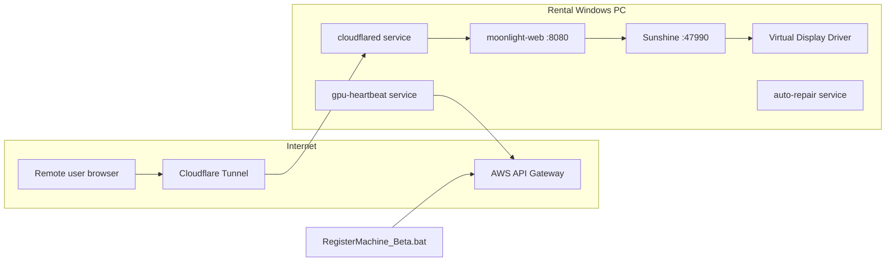

# nextGPU Core Scripts — GPU Rental Machine Setup

Windows automation for provisioning a **remote GPU gaming / rental workstation**: Sunshine streaming host, Moonlight Web client, Cloudflare Tunnel exposure, AWS backend registration, and ongoing health monitoring via Windows services.

The **primary entry point** is the root launcher `RegisterMachine_Beta.bat`. Run it once on a fresh machine (as Administrator). It delegates to `scripts/provisioning/RegisterMachine_Beta.bat`, installs drivers, streaming stack, tunnel, registers the host, and installs background services.

---

## Quick start

1. Clone or copy this folder to the target PC (e.g. `Downloads\nextGPU-corescripts`).
2. **Right-click** `RegisterMachine_Beta.bat` → **Run as administrator**
   (The script auto-elevates if needed and reopens an elevated console.)
3. Enter the prompts when asked (see [Required inputs](#required-inputs)).
4. Wait for the full install (downloads, pairing, tunnel creation, API registration).
5. **Reboot manually** when convenient — drivers, display paths, and account renames apply more reliably after restart.

---

## Required inputs

During setup, `RegisterMachine_Beta.bat` asks for:

| Prompt | Purpose |
|--------|---------|
| **Cloudflare API Token** | Create/manage tunnels and DNS for `next-gpu.com` |
| **Cloudflare Account ID** | Account that owns the tunnel |
| **API Key** | `x-api-key` header for the register-machine Lambda |
| **Computer Name** | Display name for the rental node (e.g. `GPU-RENTAL-01`); also used in Moonlight `config.json` (lowercased) |
| **Original Price** | Listing price sent to the backend (e.g. `10.99`) |
| **Vendor ID** *(optional)* | If set, sent as `vendor_id` in the `registerMachine` JSON payload; press Enter to omit |
| **Admin account username** | Existing local admin to rename → `NextGPU-Authority` |

After entry, a summary is shown; confirm with **Y** to continue or re-enter.

---

## Architecture overview



| Component | Role |
|-----------|------|
| **Sunshine** | GameStream-compatible host; encodes and streams the desktop/games |
| **Moonlight Web** | Browser client + local API on `http://127.0.0.1:8080` |
| **cloudflared** | Cloudflare Tunnel → public HTTPS hostname → local Moonlight |
| **NSSM** | Runs Moonlight, heartbeat, and auto-repair as Windows services |
| **VDD + VAD** | Virtual display and audio so headless/streaming works without a physical monitor |
| **ViGEmBus** | Virtual gamepad driver for controller input over stream |
| **AWS APIs** | `registerMachine` (one-time) and `updateStatus` (heartbeat) |

**Static defaults** (inside the batch file):

- Local ingress target: `http://127.0.0.1:8080`
- Public DNS zone: `next-gpu.com`
- Sunshine credentials set during install: `bluefml1` / `letmeinpls`

---

## `RegisterMachine_Beta.bat` — full setup flow

The root launcher delegates to `scripts/provisioning/RegisterMachine_Beta.bat`. The implementation resolves `SCRIPT_DIR` to the repo root, so generated files, logs, downloads, and service working directories stay at the same repo-root paths as before the folder reorganization. Steps below follow execution order.

### Phase 0 — Privileges and configuration

1. **Administrator check** — Uses `fltmc`; if not admin, relaunches via PowerShell `Start-Process ... -Verb RunAs` with marker `__elevated__`.
2. **Interactive configuration** — Collects Cloudflare token, account ID, API key, computer name, price, and admin username; normalizes computer name to lowercase for Moonlight config substitution (`{{computer_name}}`).
3. **WMI / CIM probe** — Runs `scripts/provisioning/Ensure-WmiSupport.ps1` (log: `logs/wmi-probe.log`). On failure, setup exits. If WMIC is missing, inventory still uses PowerShell CIM.

### Phase 1 — Virtual display and audio (pre-streaming)

4. **VDD + VAD + Virtual Driver Control** — `silent-install-vdd-vad.ps1`
   - Prompts the setup person to install/refresh VDD/VAD. If skipped or unsuccessful, setup warns but continues so Sunshine can install without a virtual display.
   - Downloads/extracts the official `VDD.Control.{version}.zip` app from VirtualDrivers releases for controller/settings access.
   - Removes existing VDD/VAD devices and driver packages, then installs fresh Virtual Display Driver + Virtual Audio Driver from GitHub driver-only packages.
   - Ensures the official settings folder exists at `C:\VirtualDisplayDriver\` (`vdd_settings.xml` location).
   - Staging: `VDD-VAD-Install\`, log: `logs/VDD-VAD.log`.
   - Setup logs a warning if VDD does not come back as a ready `DISPLAY\MTT1337*` device or a display path resolvable by `Get-DisplayDeviceId.ps1`.
   - VAD is attempted, but it is non-blocking by default because the upstream VAD can be rejected by Windows Code 52 on some Windows 11 24H2 / Server 2025 images.
   - RDP recovery access is enabled after VDD succeeds. Confirm RDP works before unplugging all physical monitors and leaving only VDD.
5. **Wait 10 seconds** — Allows the virtual display to enumerate before Sunshine configuration.

### Phase 2 — Streaming stack (labeled [1/8]–[4/8] in console)

6. **[1/8] Sunshine**
   - Removes any existing install under `C:\Program Files\Sunshine`.
   - Downloads `sunshine.zip` from [nextGPU-sunshine releases](https://github.com/bluefml1/nextGPU-sunshine/releases/latest).
   - Silent install (`Sunshine.exe /S`), sets credentials, starts Sunshine.
   - Runs `scripts\runtime\Run-StreamingStackUpdate.bat` → `Update-NextGpuStreamingStack.ps1` (shared Sunshine/Moonlight update, pairing, repo conf, VDD, PlayNite export).
   - Game publishing requires Get Started step 05 / `PlayNiteWatcher\Setup-PlayniteSteam.bat` if PlayNite is not configured yet. After installing new games on disk, run `PlayNiteWatcher\Update-PlayniteLibraries.bat` then export (or post-Sunshine setup with `-RefreshPlayniteLibrary`).
   - **`setup_sunshine_device_id` subroutine:**
     - `Get-DisplayDeviceId.ps1` resolves the VDD monitor device ID for logging; writes `dd_configuration_option = ensure_only_display` and `dd_config_revert_on_disconnect = enabled` into `sunshine.conf` (does **not** set `output_name`; set manually if you need a fixed VDD head), then restarts Sunshine.

7. **[2/8] NSSM**
   - Downloads `nssm-2.24.zip` (up to 10 attempts, curl/PowerShell rotation).
   - Extracts to `nssm\nssm-2.24\win64\nssm.exe`.

8. **[3/8] Moonlight Web**
   - Stops/removes existing `moonlight-web` service if present.
   - Downloads `moonlight-theme.zip` from [nextGPU-moonlight releases](https://github.com/bluefml1/nextGPU-moonlight/releases/latest) → `moonlight-web\`.
   - Downloads `server\config.json` and replaces `{{computer_name}}` with the lowercased custom name.
   - Registers Windows service **`moonlight-web`** via NSSM (auto-start, logs under `moonlight-web\`).

9. **[4/8] Moonlight ↔ Sunshine pairing**
   - Stops Moonlight, refreshes `server\data.json` from remote template, restarts service.
   - Logs into Moonlight API (`POST /api/login` with test credentials from template).
   - Long-poll `POST /api/pair` for a PIN, submits PIN to Sunshine HTTPS API (`https://localhost:47990/api/pin`).
   - Retries up to **100** times; continues on failure with a warning (non-fatal).

10. **ViGEmBus** — `ViGEmBus.bat inline` (virtual gamepad driver). Warning-only on failure.

### Phase 3 — Cloudflare Tunnel and DNS

11. **[5/8] cloudflared**
    - Downloads `cloudflared.exe` if missing.
    - Verifies API token against Cloudflare.
    - Resolves **Zone ID** for `next-gpu.com`.

12. **[6/8] Network identity**
    - **Public IP:** `https://api.ipify.org` (fallback `127.0.0.1`).
    - **Private IP:** first `192.168.1.*` from `ipconfig`.
    - **DNS_ID:** 8-character uppercase ID from SHA-256(`publicIP,computerName`) mapped to `a-z0-9`.
    - **DOMAIN:** `{DNS_ID}.next-gpu.com`
    - **TUNNEL_NAME:** `{DNS_ID}-tunnel`
    - If tunnel name already exists, appends a random 4-character suffix and rechecks.

13. **[7/8] Tunnel + DNS + service**
    - Creates Cloudflare tunnel via API; configures ingress: hostname → `http://127.0.0.1:8080`, catch-all 404.
    - Deletes conflicting DNS record if any; creates proxied **CNAME** → `{tunnel_id}.cfargotunnel.com`.
    - Removes old `cloudflared` service/registry if present.
    - Sets machine env `CLOUDFLARE_TUNNEL_TOKEN`, runs `cloudflared service install`, starts **`cloudflared`** service.

### Phase 4 — Inventory, registration, and persistence

14. **System inventory** — `Get-MachineInventory.ps1` (CIM): OS, CPU, RAM (GB), GPU name, `LAST_CHECKIN` timestamp.
15. **Benchmarks (optional)** — `Get-BenchmarkScores-Silent.ps1` → `bench_mark_cpu`, `bench_mark_gpu` (default `0` if missing).
16. **Game list for API** — Queries `http://localhost:8080/api/apps?host_id=0` and builds JSON map of game title → stream URL (`https://{DOMAIN}/stream.html?hostId=0&appId=...`).
17. **Register machine** — `POST` to
    `https://oa0bwhfkqk.execute-api.ap-southeast-1.amazonaws.com/registerMachine`
    with header `x-api-key: {API_KEY}` and JSON payload (name, IPs, status, domain, hardware, benchmarks, price, optional `vendor_id`, notes, optional games).
    - Log: `logs/register_api_log.txt`
18. **`domain.txt`** — Writes `DOMAIN`, `PUBLIC_IP`, `COMPUTER_NAME` for heartbeat/repair scripts.

### Phase 5 — Background services and scheduled tasks

19. **Heartbeat service** — NSSM installs **`gpu-heartbeat`** running `scripts/runtime/heartbeat-only.bat` (interval **300 s** by default; see script `INTERVAL_SECONDS`). Logs: `logs/heartbeat.log`, `logs/heartbeat-error.log`.

20. **Auto-repair service** — NSSM installs **`auto-repair`** running `scripts/runtime/auto-repair.bat` (checks every **60 s**). Monitors cloudflared, Sunshine, moonlight-web, and local HTTP `127.0.0.1:8080`; can reinstall Sunshine/Moonlight on failure. Logs: `logs/auto-repair.log`, `logs/auto-repair-error.log`.

21. **Scheduled tasks (PowerShell)**
    - `TaskScheduler.ps1` — Registers **EndSession** task (SYSTEM): on Application log event from `LogoffManager` (Event ID 2002), runs Sunshine `endSession.ps1`.
    - `launchGameTaskScheduler.ps1` — Registers **auto game launch** at user logon → `Z:\launchGame.ps1` (ensure `Z:` and script exist on the image).

### Phase 6 — Wallpaper, accounts, and finish

22. **Wallpaper** — `scripts/desktop/Setup-Wallpaper.bat inline` -> `scripts/desktop/Set-DesktopWallpaper-Gpo.ps1` (Fit desktop, lock/sign-in, **`nextGPU-WallpaperFitLogon`**; runs **before** account changes).
23. **Rename admin** — Renames `{ADMIN_ACCOUNT_NAME}` → **`NextGPU-Authority`** (username + full name).
24. **Create user** — creates local group **`NextGPURestricted`**, then `net user nextGPU /add`, then adds **nextGPU** to **NextGPURestricted** (standard user for rental sessions; remains in **BUILTIN\Users**). Registers **`nextGPU-DesktopCleanupLogon`**: at every **nextGPU** logon, `Clear-NextGpuUserDesktop.ps1` removes all items from that user’s Desktop folder (and runs once from setup if the profile folder already exists). Does **not** clear **`C:\Users\Public\Desktop`** (those shortcuts still appear for every user unless removed separately).
25. **Shutdown lock** — `Setup-Shutdown-Policy.bat` / `Set-ShutdownPolicy.ps1`: only **`NextGPU-Authority`** may shut down or restart; `nextGPU` and all other users are blocked (user rights + Start menu policy + logon task).
26. **Completion message** — Prompts for **manual reboot** (drivers, display paths, accounts).

---

## Wallpaper only (standalone)

Run as Administrator from the repo root:

```bat
scripts\desktop\Setup-Wallpaper.bat
```

## Shutdown lock only (standalone)

Restrict shut down and restart to **NextGPU-Authority** only (`nextGPU` and other users blocked):

```bat
scripts\desktop\Setup-Shutdown-Policy.bat
```

Requires `assets\nextgputobu.jpeg` in the repo. After setup, verify on the GPU PC:

```powershell
powershell -ExecutionPolicy Bypass -File scripts\desktop\Test-WallpaperPolicy.ps1
```

Look for **`[OK] WallpaperStyle = 6`**, desktop path pointing to **`nextgputobu-4k.bmp`** or **4K JPEG**, and **no** `WallpaperStyle = 10` (Fill/crop). After success, open **Local Group Policy Editor** → **User Configuration** → **Administrative Templates** → **Desktop** → **Desktop** → **Desktop Wallpaper** — it should show **Enabled**, path `C:\Users\Public\Wallpaper\nextgputobu.jpeg`, style **Fit**. **Desktop** uses a fixed **3840×2160** master (`nextgputobu-4k.bmp`, or your **4K JPEG** directly if it is already 3840×2160) with **Fit** (`Policies\System` = `3`, `Control Panel\Desktop` = `6`) so the **full** image shows on 1080p/1440p/4K rentals. **Lock/sign-in** keeps **`nextgputobu.jpeg`**. **`nextGPU-WallpaperFitLogon`** re-applies on logon. Setup hides icons and clears Public Desktop shortcuts. (**Computer Configuration** → same desktop wallpaper policy stays *Not Configured*; Desktop Wallpaper is a user policy only.)

---

## Ongoing operations (after setup)

### Heartbeat (`scripts/runtime/heartbeat-only.bat` -> service `gpu-heartbeat`)

Runs in a loop (default **every 300 seconds**):

1. Reads `domain.txt` (`DOMAIN`, `PUBLIC_IP`, `COMPUTER_NAME`, optional `STATUS`).
2. Refreshes private IP (`192.168.1.*`).
3. `POST` to `https://oa0bwhfkqk.execute-api.ap-southeast-1.amazonaws.com/updateStatus` with JSON: computer name, public/private IP, status.

To change the interval, edit `INTERVAL_SECONDS` near the top of `scripts/runtime/heartbeat-only.bat` and restart the service.

### Auto-repair (`scripts/runtime/auto-repair.bat` -> service `auto-repair`)

Every **60 seconds** (after network is reachable):

| Check | Action if failed |
|-------|------------------|
| `cloudflared` service running | `net start cloudflared` |
| `sunshine.exe` process | Start or full reinstall from GitHub zip |
| `moonlight-web` service | `net start` or reinstall Moonlight + NSSM |
| `http://127.0.0.1:8080` returns 200 | Triggers full repair path |

Skips repair when `domain.txt` has `STATUS=updating`.

On full repair, runs `scripts/runtime/Run-StreamingStackUpdate.bat ForceReinstall ForceReinstall ForcePairing` → `Update-NextGpuStreamingStack.ps1` (same Sunshine/Moonlight/pairing path as update scripts, but always reinstalls and re-pairs).

### Shared streaming stack (`Update-NextGpuStreamingStack.ps1`)

`auto-update.bat`, `checking-update.bat`, and `auto-repair.bat` no longer duplicate Sunshine/Moonlight logic. They call `scripts/runtime/Run-StreamingStackUpdate.bat`, which invokes `scripts/provisioning/Update-NextGpuStreamingStack.ps1`.

| Caller | Sunshine mode | Moonlight mode | Pairing |
|--------|---------------|----------------|---------|
| `auto-update.bat` | `CheckUpdate` | `CheckUpdate` | After update only |
| `checking-update.bat` | `CheckUpdate` | `CheckUpdate` | After update only |
| `auto-repair.bat` (full repair) | `ForceReinstall` | `ForceReinstall` | Always (`ForcePairing`) |

After Sunshine install/reinstall, the stack runs `Invoke-PostSunshineSetup.ps1`:

1. `Install-SunshineScripts.ps1` — repo `sunshine.conf` → `config/`, `dd_*` settings, support scripts
2. `Set-SunshineVddOutput.ps1` — up to 6 retries with Sunshine restart; resolves VDD `device_id` from sunshine.log (scored complete entry: `display_name` + `info`) when usable, otherwise from `Get-DisplayDeviceId.ps1`; writes `output_name` to `sunshine.conf` (logs to `logs/sunshine-vdd-setup.log`; WARN only if not resolved)
3. PlayNite export when `PlayNiteWatcher\PlayniteInstall.path` exists

`RegisterMachine_Beta.bat` `:setup_sunshine_device_id` is unchanged (writes `dd_*` only; does not set `output_name` automatically).

### Other maintenance scripts (not run by main setup)

| Script | Purpose |
|--------|---------|
| `scripts/runtime/auto-update.bat` | Remote-triggered update; uses shared streaming stack (`CheckUpdate`) |
| `scripts/runtime/checking-update.bat` | Periodic update check; uses shared streaming stack (`CheckUpdate`) |
| `scripts/runtime/Run-StreamingStackUpdate.bat` | Thin wrapper for `Update-NextGpuStreamingStack.ps1` |
| `scripts/provisioning/Update-NextGpuStreamingStack.ps1` | Sunshine + Moonlight install/update/pairing (single source of truth) |
| `scripts/maintenance/copy.bat` / `scripts/maintenance/extract.bat` / `scripts/maintenance/garena.bat` | Image-specific game/app deployment |
| `scripts/drivers/InstallVDD-VAD.bat` | Standalone VDD+VAD installer wrapper |

See `docs/Main script to do.txt` for a high-level manual checklist used on some images (VDD, Sunshine/Moonlight, ViGEmBus, disk shrink, game copy, users, reboot).

---

## Windows services created

| Service name | Executable / command | Display name |
|--------------|----------------------|--------------|
| `moonlight-web` | `moonlight-web\web-server.exe` | Moonlight Web Stream |
| `cloudflared` | `cloudflared.exe` (tunnel token) | Cloudflare Tunnel |
| `gpu-heartbeat` | `cmd /c heartbeat-only.bat` | GPU Heartbeat |
| `gpu-sunshine` | `C:\Program Files\Sunshine\sunshine.exe` | GPU Sunshine (elevated) |
| `auto-repair` | `cmd /c auto-repair.bat` | Auto-Repair |

Sunshine is started in the **logged-on user session** (scheduled task `nextGPU-SunshineLogon` + `Start-Sunshine-InSession.ps1`). The NSSM service `gpu-sunshine` is installed on **demand start** only as a fallback — running Sunshine as `LocalSystem` in session 0 causes `ERROR_ACCESS_DENIED` when querying display paths (empty `[]` device list) even when VDD is installed. After VDD install, **reboot**, then **RDP or console logon** once so Sunshine can see the virtual display.

---

## Key files and logs

```
nextGPU-corescripts/
├── RegisterMachine_Beta.bat      # Main setup launcher
├── uninstall-all.bat             # Root uninstall launcher
├── scripts/
│   ├── provisioning/             # Main setup + inventory/display helpers
│   ├── runtime/                  # Heartbeat, repair, update loops
│   ├── drivers/                  # VDD/VAD + ViGEmBus installers
│   ├── desktop/                  # Wallpaper policy scripts
│   ├── tasks/                    # Scheduled task registration
│   └── maintenance/              # Games, copy/extract, uninstall helpers
├── docs/                         # README, getting started, checklist
├── assets/
│   └── nextgputobu.jpeg          # Wallpaper source
├── domain.txt                    # Created at end of setup (required for heartbeat)
├── logs/                         # Generated repo logs
│   ├── register_api_log.txt
│   ├── setup_log_YYYYMMDD.txt
│   ├── wmi-probe.log
│   ├── VDD-VAD.log
│   ├── heartbeat.log
│   ├── heartbeat-error.log
│   ├── auto-repair.log
│   └── auto-repair-error.log
├── moonlight-web/                # Downloaded at setup
├── nssm/                         # NSSM binaries
├── sunshine/                     # Extracted installer + support scripts (legacy Add-SteamGames.ps1)
└── cloudflared.exe               # Downloaded if missing
```

---

## External dependencies (downloaded at runtime)

| Asset | Source |
|-------|--------|
| Sunshine | `github.com/bluefml1/nextGPU-sunshine` (latest `sunshine.zip`) |
| Moonlight Web | `github.com/bluefml1/nextGPU-moonlight` (latest `moonlight-theme.zip`) |
| Moonlight `config.json` / `data.json` | `github.com/Nguyenanvu202/bongsenvang-config` / `bongsenvang-data` |
| NSSM | `github.com/Nguyenanvu202/NssmService` |
| cloudflared | Cloudflare releases (windows-amd64) |
| VDD/VAD/NefCon | GitHub (via `silent-install-vdd-vad.ps1`) |

Requires **curl** (or PowerShell fallback), **PowerShell 5.1+**, and outbound HTTPS.

---

## Per-user S3 storage (opt-in)

After setup, an administrator can enable tenant personal storage for the **nextGPU** rental account:

1. Install credentials: machine env `NEXTGPU_USER_S3_ACCESS_KEY` / `NEXTGPU_USER_S3_SECRET_KEY`, or `%ProgramData%\nextGPU\secrets\user-s3.env` (see `scripts/runtime/user-s3.env.example`).
2. Run `scripts/runtime/Setup-UserStorage.bat` **once** (installs WinFsp/rclone if needed, writes `%ProgramData%\nextGPU\rclone\rclone.conf`, registers logon/logoff tasks). Recreating the `nextGPU` user does not require setup again — `nextGPU-UserStorageEnsureBindings` re-binds at boot and nextGPU logon.
3. On **nextGPU** logon, `Mount-UserStorage.ps1` reads `domain.txt`, calls `checkDomain`, and mounts `nextgpu-user:{userID}/` as **`U:`** with a `{lastName}'s Storage` label. On logoff, `Unmount-UserStorage.ps1` stops rclone and clears state.

This is separate from R2 games sync (`Sync-GamesApps-Official.ps1`). Uninstall removes `nextGPU-UserStorage*` tasks and ProgramData rclone/secrets paths.

---

## Security notes

- Setup prompts for **secrets in the console** (Cloudflare token, API key). Do not commit real tokens; rotate if logs are shared.
- **User S3 keys** for `nextgpu-user` rclone must not be committed; use env or `%ProgramData%\nextGPU\secrets\` only.
- Default Sunshine and Moonlight test credentials are embedded for automated pairing — change for production hardening if needed.
- Tunnel token is stored in the **machine** environment variable `CLOUDFLARE_TUNNEL_TOKEN`.
- After setup, the former admin account is renamed to **`NextGPU-Authority`**; a separate **`nextGPU`** user is created for non-admin sessions.

---

## Setup guides

| Guide | Audience |
| ----- | -------- |
| [setup-beginer.md](setup-beginer.md) | Visual walkthrough with screenshots (start here if you want pictures) |
| [machine-setup-beginer.md](machine-setup-beginer.md) | Full beginner guide with troubleshooting and glossary |
| [machine-setup-guide.md](machine-setup-guide.md) | Technical end-to-end reference |
| [started.md](started.md) | Short repo orientation |

---

## Troubleshooting

| Symptom | What to check |
|---------|----------------|
| Setup exits at WMI step | `logs/wmi-probe.log`, run `scripts/provisioning/Ensure-WmiSupport.ps1` manually |
| No virtual display in Sunshine | Inspect `logs\VDD-VAD.log`, `logs\sunshine-vdd-setup.log`, reboot, then run `Get-DisplayDeviceId.ps1 -ListAll -IncludeInactive` |
| Pairing warnings | Sunshine running? Firewall on 47990? See Moonlight logs in `%TEMP%` |
| Heartbeat errors | `domain.txt` exists? `gpu-heartbeat` service running? Check `logs/heartbeat.log`. |
| Public URL not loading | `sc query cloudflared`, tunnel DNS in Cloudflare dashboard |
| Registration failed | `logs/register_api_log.txt`, API key, payload size (games JSON) |

---

## Technologies

- **Sunshine** — Game streaming host
- **Moonlight Web** — Browser streaming client
- **Cloudflare Tunnel (`cloudflared`)** — HTTPS without opening inbound ports
- **NSSM** — Non-interactive Windows services from batch files
- **AWS API Gateway** — `registerMachine` / `updateStatus`
- **PowerShell CIM** — Hardware inventory without deprecated `wmic`
- **ViGEmBus** — Virtual Xbox/controller driver

---

## Related manual checklist

`docs/Main script to do.txt` lists steps sometimes done on the golden image **before or after** this script (game deletion, disk shrink, game copy, non-admin user, reboot). `RegisterMachine_Beta.bat` automates VDD, Sunshine, Moonlight, tunnel, registration, heartbeat, repair, wallpaper, and account rename/create.
