# nextGPU Machine Setup Guide (Beginner Edition)

**Start here if this is your first time setting up a nextGPU machine.** No prior knowledge assumed.

**Prefer screenshots for every click?** Open [`setup-beginer.md`](setup-beginer.md) — it embeds the same images inline. This file adds longer explanations and troubleshooting; key steps include screenshots too.

---

## What you're actually building

In plain terms: you're turning a Windows PC with a GPU into a machine that other people can rent and stream games on remotely (like a cloud gaming PC you host). When you're done, a renter will be able to open a link in their browser and play games running on this physical machine, from anywhere.

To make that work, this guide walks you through installing a few pieces of software that each do one job:


| Piece                    | What it does in one sentence                                                                                         |
| ------------------------ | -------------------------------------------------------------------------------------------------------------------- |
| **NextGPU Controller**   | The app you click buttons in. It runs all the setup scripts for you.                                                 |
| **RegisterMachine**      | The big one-time setup script. Installs drivers, sets up streaming, and tells nextGPU's servers this machine exists. |
| **Sunshine + Moonlight** | The actual game-streaming software (Sunshine runs on this PC, Moonlight is what the renter uses to watch/play).      |
| **Cloudflare Tunnel**    | Gives your machine a public web address without you touching your router.                                            |
| **PlayNite**             | Scans for installed games (Steam, Epic, etc.) and makes them show up as launchable options for the renter.           |


You only do most of this **once per machine**. After that, it mostly runs itself.

**Time estimate:** 1–2 hours for a first machine, including a couple of reboots. Most of that is waiting for downloads and installs, not active work.

---

## Table of contents

1. [Before you touch anything](#1-before-you-touch-anything) *(includes NVIDIA — before the Controller)*
2. [Start from a clean machine](#2-decide-whether-to-clean-the-machine-first-optional)
3. [Get the files onto the machine](#3-get-the-files-onto-the-machine)
4. [Install and open the Controller app](#4-install-and-open-the-controller-app)
5. [Step 1: Check the machine is ready (STEP 01)](#step-1-check-the-machine-is-ready)
6. [Step 2: Prepare a drive for games (STEP 02)](#step-2-prepare-a-drive-for-games)
7. [Step 3: Download the official games/apps (STEP 03)](#step-3-download-the-official-gamesapps)
8. [Step 4: Run the main setup / RegisterMachine (STEP 04)](#step-4-run-the-main-setup-registermachine)
9. [Step 5: Set up renter storage / U: (STEP 05)](#step-5-set-up-renter-storage-the-u-drive)
10. [Step 6: Add games with PlayNite (STEP 06)](#step-6-add-games-with-playnite)
11. [Step 7: Final check before going live (STEP 07)](#step-7-final-check-before-going-live)
12. [If something goes wrong](#if-something-goes-wrong)
13. [Glossary](#glossary)
14. [Where to find things later](#where-to-find-things-later)

**Controller alignment:** Steps 1–7 match **Get Started → STEP 01–07** in the NextGPU app. NVIDIA is prep in [section 1](#nvidia-driver-and-settings-before-the-controller) (no app button).

---

## 1. Before you touch anything

### Check the machine qualifies


| Need                                               | Why                                                                                                              |
| -------------------------------------------------- | ---------------------------------------------------------------------------------------------------------------- |
| Windows 10 or 11 (64-bit)                          | This whole system is Windows-only.                                                                               |
| An NVIDIA GPU                                      | Needed for smooth game streaming.                                                                                |
| Normal internet access                             | It needs to reach GitHub, Cloudflare, and AWS — standard outbound web access, nothing special to configure.      |
| You can log in as Administrator                    | Every step below needs admin rights. If you only have a standard account, get the admin password first.          |
| Free space on a second drive (or room to make one) | Games and apps get stored separately from Windows itself. We'll create this drive in Step 2 if it doesn't exist. |


> A heads-up, not a blocker: on some newer Windows installs (specifically "11 24H2" or "Server 2025"), one of the audio drivers later in this guide is known to occasionally fail to install cleanly. It won't stop you from finishing setup — streaming video and renter access still work fine. We'll point it out again when it comes up.

### NVIDIA driver and settings (before the Controller)

**What you're doing:** install the latest **Game Ready** driver and set **Graphics → Global Settings** for stable streaming. **No Get Started button** — do this on the machine before Step 4 (RegisterMachine) / before you rely on the Controller for provisioning.

**Do this before [Install the Controller](#4-install-and-open-the-controller-app).** A reboot after the driver is normal; RegisterMachine will ask for another reboot later.

#### Turn off Windows Firewall first

Turn **Windows Defender Firewall** off before installing or updating the NVIDIA driver — otherwise the install can fail or hang.

1. Search Windows for **Windows Defender Firewall**, or open **Control Panel → System and Security → Windows Defender Firewall**.
2. In the left sidebar, click **Turn Windows Defender Firewall on or off**.
3. Under both **Private network settings** and **Public network settings**, select **Turn off Windows Defender Firewall**.
4. Click **OK**. Confirm both sections show **Windows Defender Firewall state: Off**.

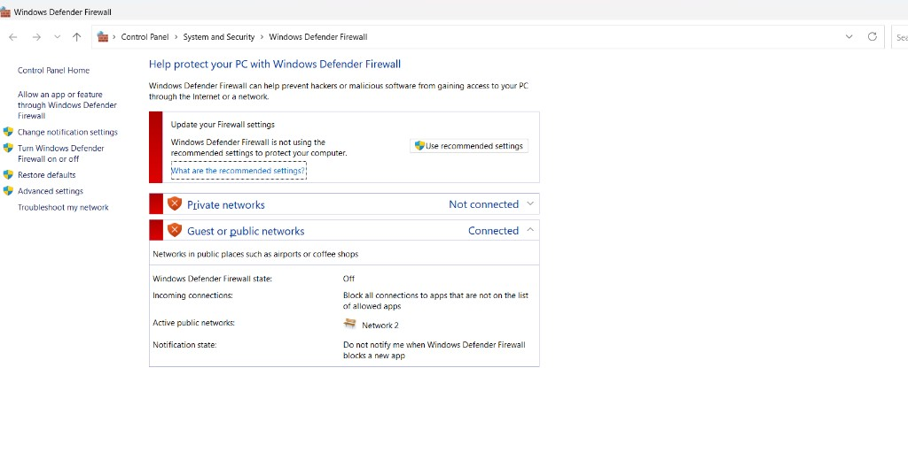

#### Install the latest Game Ready driver

Use the **NVIDIA App** on the machine — no need to download the driver from a website.

1. Press the **Windows** key and type **NVIDIA** — open **NVIDIA App**.
  - Don't see it? Install **NVIDIA App** from the **Microsoft Store**, then open it.
2. In NVIDIA App, open the **Drivers** tab.
3. Set driver type to **Game Ready Driver** (not Studio Driver).
4. Install with **Express Installation** if an update is listed.
5. **Reboot when the installer asks you to.**

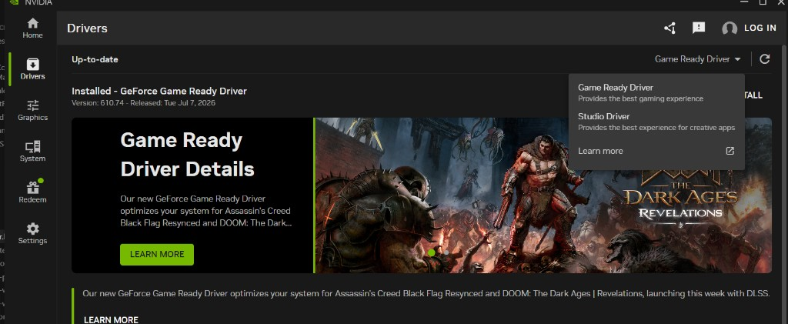

**What "success" looks like:** Drivers shows **Up-to-date**; GPU has no warning in Device Manager → **Display adapters**.

#### Global Settings (Graphics tab only)

Under **Graphics → Global Settings** — not the sidebar **Settings** gear, not **Program Settings**:

| Setting | Set it to |
| ------- | --------- |
| **Low Latency Mode** | **Ultra** |
| **Max Frame Rate** | **120 FPS** |
| **Vertical sync** | **Off** |
| **Background Application Max Frame Rate** | **120 FPS** *(Legacy settings if needed)* |

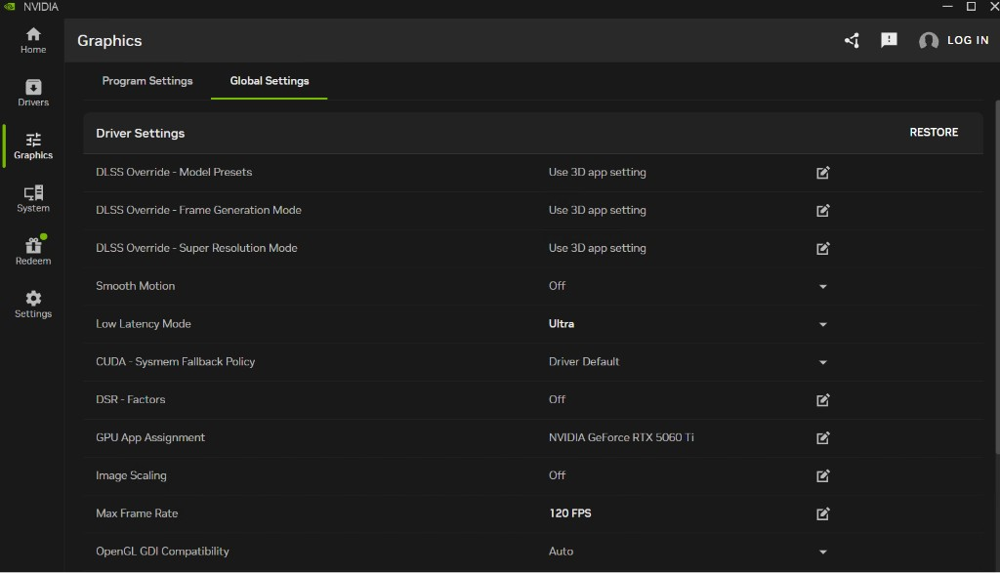

**Why these values?** 120 FPS matches a common streaming target; Low Latency Mode Ultra reduces input delay; VSync off avoids extra lag; capping background apps stops clutter from stealing GPU time during rentals.

### Have these ready (write them down somewhere before you start)

Think of this as your shopping list. You'll be asked for most of it mid-way through **Step 4 (RegisterMachine)** — stopping to find credentials partway through is the most common reason people redo that step.


| What                        | What it's for                                                                             | Where it usually comes from                                                                 |
| --------------------------- | ----------------------------------------------------------------------------------------- | ------------------------------------------------------------------------------------------- |
| Cloudflare API Token        | Lets this machine create its own public web address                                       | Contact with NextGPU                                                                        |
| Cloudflare Account ID       | Identifies which Cloudflare account owns that address                                     | Contact with NextGPU                                                                        |
| nextGPU API Key             | Lets this machine register itself with nextGPU's servers                                  | Contact with NextGPU                                                                        |
| A name for this computer    | What you'll see in the dashboard (e.g: `NEXTGPU-105`)                                     | Contact with NextGPU                                                                        |
| Listing price               | What this machine will be listed/rented for (e.g: 4000)                                   | Contact with NextGPU                                                                        |
| Vendor ID *(optional)*      | Only needed if you're a vendor partner — otherwise just press Enter to skip               | Your nextGPU contact, if applicable                                                         |
| Your current admin username | The setup will rename this account — see note below(eg: ezycloudx-admin, pcrender, admin) | Already on your machine(check what username you log-on open cmd and type: "echo %USERNAME%" |


**Important about that last one:** the setup process renames your current admin account to `NextGPU-Authority` and creates a brand new everyday account called `nextGPU` (this is the one renters actually use). Your admin login still works after the rename — it just has a new name and becomes the "owner" account that can shut the machine down. Nothing is deleted.

You'll also want these later, for **Step 5 (U: storage)** — gather now or just before that step:


| What                       | What it's for                                                       |
| -------------------------- | ------------------------------------------------------------------- |
| S3 Access Key + Secret Key | Lets each renter get their own private storage drive on the machine |


**One rule that matters everywhere in this guide:** never paste real tokens, keys, or passwords into a shared chat, ticket, or document. Treat them like a password, because they function like one.

---

## 2. Decide whether to clean the machine first (optional)

**This step is optional — evaluate your machine before deciding.** Unlike the rest of this guide, there's no single right answer here; it depends on the machine itself.

**Why this is even a question:** every application this machine will run during a rental session — game launchers, streaming software, everything — gets installed and managed by nextGPU's own setup in the steps that follow. Leftover software from before (old apps, trial programs, a previous owner's installs) doesn't strictly block setup, but it can take up disk space and occasionally conflicts with the streaming or game-detection steps later.

### When it's worth cleaning

- The machine has a lot of unrelated software already installed, especially anything that auto-starts, runs in the background, or does its own screen capture / remote access (these are the most likely to conflict with Sunshine later).
- Disk space is tight and old software is eating into the room you'll want for games on `Z:`.
- You don't know the machine's history — it was handed down, bought used, or repurposed from something unrelated.

### When you can reasonably skip it

- The machine is a known, purpose-built rig with fast NVMe storage and you specifically want to put it into service for nextGPU as-is — in that case, the speed and capacity of the hardware is the main reason you're using it, and a full wipe mostly costs you time without much benefit.
- It's already a fresh or near-fresh Windows install with nothing but standard manufacturer software on it.
- You've already confirmed nothing on the machine conflicts with streaming software (no other remote-desktop or capture tools running).

If you're not sure which bucket your machine falls into, erring toward cleaning is the safer default — but it's your call, not a hard requirement.

**Recommended tool:** HiBit Uninstaller — download it from: [https://v30.x8top.net/tmp082020/cf/soft/2018/3/ba/4/hibit-uninstaller_1424.exe](https://v30.x8top.net/tmp082020/cf/soft/2018/3/ba/4/hibit-uninstaller_1424.exe)

### Uninstall existing applications individually

1. Download and install HiBit Uninstaller from the link above.
2. Open it and review the list of installed applications.
3. Remove anything not required for Windows itself to run. When in doubt about whether something is safe to remove, leave it — you can always remove it later, but a mistakenly-deleted system component can mean reinstalling Windows anyway.
4. Reboot once you're done clearing applications, before moving on to Step 3.

**Either way, confirm before continuing:** Windows boots cleanly, you can log in as Administrator, and there's no leftover game launcher, streaming tool, or remote-access software still running in the background that might compete with what nextGPU installs next.

---

## 3. Get the files onto the machine

1. Download the setup package: [RegisterMachine.zip](https://github.com/bluefml1/nextGPU-corescripts/releases/latest/download/RegisterMachine.zip) (always points to the latest release)
2. Extract the zip somewhere permanent on the **local C: drive** — or **Downloads folder**
3. **Pick a folder now and don't move it later.** Once **Step 6 (PlayNite)** runs, several scripts remember this exact location. Moving the folder afterward will break things.

That's the whole step — you now have a folder full of scripts and an app installer sitting on the machine.

---

## 4. Install and open the Controller app

The Controller is a small desktop app with buttons for everything below. You technically *can* run every step by typing commands instead, but there's no reason to — the app runs the exact same scripts and shows you what's happening as it goes. This guide assumes you're using it.

1. Open the folder from Step 2.
2. Double-click `NextGPU.bat`.
3. If Windows shows a security prompt asking to let it make changes, click **Yes** — the app needs Administrator rights to do anything useful.
4. Sign in with the credentials from your nextGPU onboarding email or admin. *(If you don't have these yet, that's expected for a brand-new install — contact your admin before continuing)*

Once you're in, you'll land on a **Get Started** page with **STEP 01–07**. Guide Steps 1–7 below match those cards (NVIDIA in [section 1](#nvidia-driver-and-settings-before-the-controller) is the only prep step without a card).

---

## Step 1: Check the machine is ready

**Controller STEP 01 — Validate Environment**

**What you're doing:** running a quick scan that confirms nothing is missing from the setup folder before any real changes happen. Think of it as a pre-flight check.

**Click:** `Run Layout Test`

**What "success" looks like:**

- A list of checks, each ending in `[OK]`
- A final line reading **"All layout checks passed"**

**If something fails:**

- Most often, the folder from Step 2 didn't extract completely. Delete it and re-extract the zip fresh.
- Double check you're running this on the Windows machine itself, not from a Mac or Linux computer.

You can't usefully continue past this step until it passes — fix any `[FAIL]` lines first.

---

## Step 2: Prepare a drive for games

**Controller STEP 02 — Disk Prep**

**What you're doing:** Windows normally has everything on one drive (`C:`). This step creates (or resizes) a separate drive — typically called `Z:` — specifically for games and apps, so they're kept separate from the operating system.

**Click:** `Open Disk Management`, then `Run CHKDSK Repair`

### 2a. Quick health check first(Must be running)

Click **Run CHKDSK Repair**. This scans your drive for filesystem errors before resizing anything — skipping this is how partition resizing goes wrong. You'll be asked whether to check one drive or all of them; checking all is the safer default. If it asks to schedule a repair on next reboot, allow it and restart when convenient.

### 2b. Create the games drive

From the Disk Management page, click **Shrink Volume (Extend Existing or Create New)**. You'll be asked:

1. Which drive to take space from (usually `C:`)
2. How much space, in GB, to take
3. Whether to extend an existing `Z:` drive or create a brand new one

If you're not sure how much space to allocate: Windows will recommend for you how many GBs to allocated

**When you're done, your drives should look roughly like this:**


| Drive | What lives there                                     |
| ----- | ---------------------------------------------------- |
| `C:`  | Windows itself — leave this alone going forward      |
| `Z:`  | Games, Adobe apps, and the scripts that launch games |


**If the shrink fails:** this almost always means Windows has something "pinned" to the end of the drive that can't move. Three usual fixes, in order: turn off hibernation (search Windows for "Command Prompt", run `powercfg /h off`), move your page file off that drive, or delete System Restore points on that drive. Reboot and try the shrink again after any of these.

---

## Step 3: Download the official games/apps

**Controller STEP 03 — Sync Official Game Data**

**What you're doing:** pulling pre-approved game and app installers from nextGPU's official storage, and unpacking them onto your new `Z:` drive.

**Click:** `Sync Game/Apps`

You'll be shown a list of available archives and can pick which ones to download. Each one downloads with a visible progress bar and gets automatically unpacked to the right folder on `Z:` (for example, `Z:\Steam` or `Z:\Adobe`).

**What "success" looks like:**

- The games/apps you picked now have folders on `Z:`
- No lines in the log mentioning `[FAIL]`

**Don't worry if:** you see a warning about "winget" returning a non-zero result, or a "remote preflight" warning — both are harmless as long as files actually show up afterward. Only worry if a folder you selected is genuinely empty.

You can come back and re-run this step later any time new official content is added.

---

## Step 4: Run the main setup (RegisterMachine)

**Controller STEP 04 — Provision Full Host**

This is the big one — it's the longest step and the one that needs your full attention, since it'll ask you questions partway through.

**What you're doing:** installing the virtual display and audio drivers, installing the streaming software (Sunshine/Moonlight), setting up your public web address via Cloudflare, and telling nextGPU's servers that this machine exists and is ready to be listed.

**Have your list from [Section 1](#have-these-ready-write-them-down-somewhere-before-you-start) open and ready before you click the button** — you'll be asked for most of it within the first minute.

**Click:** `Run RegisterMachine`

1. Windows may ask for permission to make changes — click **Yes**.
2. The Controller opens **Register Machine — Configuration**. Fill every required field, then click **Run Register Machine**. An elevated console continues the rest of setup.

| Field | What it's for | Notes |
| ----- | ------------- | ----- |
| Install VDD/VAD | Virtual display + audio for headless streaming | Choose **No** only if this machine uses a physical monitor only |
| Cloudflare API Token | Public web address for this machine | From NextGPU |
| Cloudflare Account ID | Cloudflare account that owns the tunnel | From NextGPU |
| API Key | Register this machine with nextGPU servers | From NextGPU |
| Computer Name | Dashboard label (e.g. `NEXTGPU-105`) | From NextGPU |
| Original Price | Listing / rental price | From NextGPU |
| Vendor ID *(optional)* | Vendor partner id | Leave blank if not applicable |
| **NextGPU-Admin password** | Password for `NextGPU-Admin` (RunAsTool + session management) | Required. Stored with DPAPI — write it down safely |
| Admin account to rename | Existing local admin → `NextGPU-Authority` | Usually your current login (`echo %USERNAME%`) |

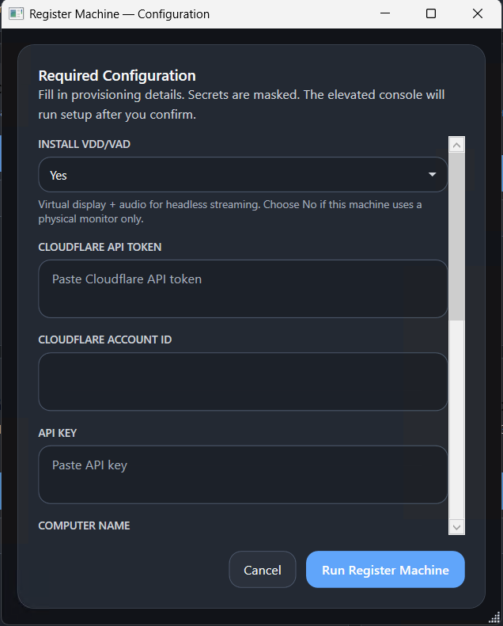

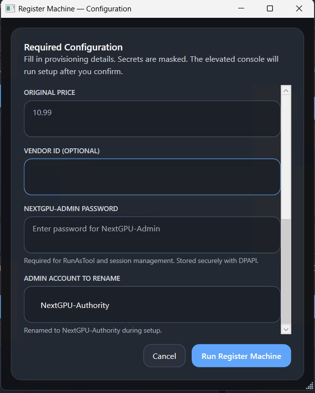

3. From here, it runs unattended for a while. You can watch progress with `Open Provisioning Logs` if you're curious, but you don't need to do anything else until it finishes.

**Don't worry if:** you entered wrong credentials or mismatched something — close the console, then run Step 4 again with corrected values.

### What's actually happening behind the scenes (for context, not action)


| Stage                   | In plain terms                                                                                                               |
| ----------------------- | ---------------------------------------------------------------------------------------------------------------------------- |
| Setup check             | Confirms you're an admin and looks at your hardware                                                                          |
| Virtual display & audio | Installs drivers that let the machine "pretend" to have a monitor and speakers plugged in, even with nobody physically there |
| Streaming setup         | Installs Sunshine (the streaming server) and pairs it with Moonlight (the viewer)                                            |
| Public address          | Creates your Cloudflare tunnel and DNS so the machine has a web address                                                      |
| Registration            | Sends your hardware details to nextGPU's servers and gets this machine officially listed                                     |
| Background services     | Sets up the small always-running programs that keep things healthy (heartbeat, auto-repair)                                  |
| Wrap-up                 | Applies the wallpaper, renames your admin account, creates `nextGPU` and `NextGPU-Admin` |


### When it finishes

1. **Reboot when it tells you to.** This isn't optional — several of the changes (drivers, the account rename) only take full effect after a restart.
2. After rebooting, log in **once**, either via Remote Desktop or directly on the machine with username: NextGPU-Authority.
3. Open the file `domain.txt` (in your setup folder) — it has a web address in it. Open that address in a browser and confirm Moonlight Web loads.

---

## Step 5: Set up renter storage (the U: drive)

**Controller STEP 05 — Per-User S3 Storage (U:)**

**Requires:** Step 4 must be fully finished first (it creates a file called `domain.txt` that this step needs).

**What you're doing:** giving each renter their own private storage drive, labeled `U:`, that shows up automatically about 22 seconds after they log in.

**Click:** `One-Click S3 Setup`

This installs a couple of small background tools and quietly sets up two scheduled tasks that handle mounting the drive whenever the `nextGPU` rental account logs in — you won't need to trigger this manually going forward.

### Enter your storage credentials

You'll need the S3 Access Key and Secret Key from your list in Section 1. The app will prompt you for these directly — you don't need to manually edit any files.

### Confirm it worked

1. Log in as the `nextGPU` account (the rental account created in Step 4) — either directly or through a Moonlight session.
2. Wait about 22 seconds.
3. A `U:` drive should appear, labeled with something like "**{Name}'s Storage**".

**If it doesn't appear:** open the **User Storage** page in the Controller and click **Diagnose & fix** — this checks the most common causes (permissions, the storage tool itself, and the connection) and fixes what it can automatically.

> **Note for later:** if you ever delete and recreate the `nextGPU` account, don't redo this whole step — there's a smaller "Sync" option instead. Worth knowing now, not urgent yet.

---

## Step 6: Add games with PlayNite

**Controller STEP 06 — Implement PlayNite**

**Requires:** Step 4 must be finished (this step needs Sunshine, which Step 4 installs).

**What you're doing:** scanning for games already installed on the machine (Steam, Epic, etc.), making them show up for renters in Moonlight, then configuring **Setup Games & Apps** and **Bypass** for **only the apps NextGPU assigned to this machine**.

In the Controller this card is **STEP 06 — Implement PlayNite** with three buttons: **1. Run Playnite Setup**, **2. Setup Games & Apps**, **3. Host admin / Clean Session** (opens **Bypass** — admin, service, Steam ACL, allowlist, Clean Session).

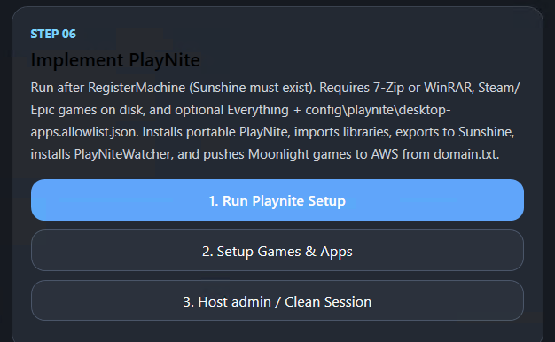

**Before you click anything**, make sure the games you want available are actually installed on this machine already — Playnite finds existing installs; it doesn't install games for you. Keep your **assigned apps list** handy for the Setup Games & Apps and Bypass steps.

### 1. Run Playnite Setup

**Click:** `1. Run Playnite Setup`

1. Pick a folder to install PlayNite into (e.g. `Z:\Playnite`).
2. It downloads and unpacks PlayNite automatically.
3. It scans your drives for Steam and Epic games — no login to those services needed, it just looks at what's on disk.
4. After Steam/Epic scan it shows options to scan the allowlist: choose a specific disk/folder (faster) or all disks.
5. It exports everything it found to Sunshine, so it shows up for renters.
6. It installs a small helper (PlayNiteWatcher) that automatically closes the stream when a renter exits a game.

**What "success" looks like:** the games you expected show up on the **PlayNite** tab (launch PlayNite to confirm).

### 2. Setup Games & Apps (assigned apps only)

**Click:** `2. Setup Games & Apps`

**What you're doing:** laying out official game/app bundles on the host. Configure **only apps on your assigned list**. Clean Session rules are registered in **§3 Host admin / Clean Session**.

**First-time order:** steps 1–2 here (arrange) → complete **§3 Bypass** → return for step 3 (push to AWS).

1. Open **Setup Games & Apps** → **Host Setup** tab.
2. Run **Setup Games & Apps** (arrange) and any sync actions your assigned titles need.

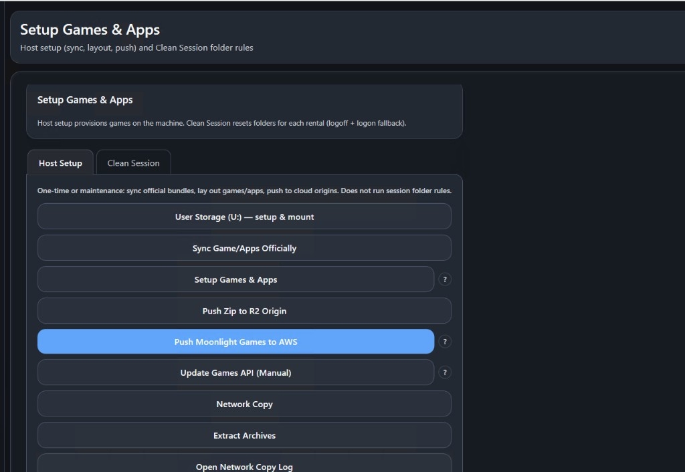

3. **Push Moonlight Games to AWS** — after host layout and **§3 Bypass** (allowlist + Clean Session if needed) for your assigned apps:

   1. On **Setup Games & Apps** → **Host Setup** tab, click **Push Moonlight Games to AWS**.
   2. Confirm `computer_name` and `publicIP` from `domain.txt`.
   3. Wait until the console ends with **`SUCCESS`**.

   Renters see the updated list on the dashboard only after this push succeeds.

   **Later:** when you add or change games, update libraries / re-arrange as needed, then run **Push Moonlight Games to AWS** again.

   **If push fails:** restart Sunshine (`https://localhost:47990` → **Troubleshooting** → restart, or Controller → **Sunshine**), then push again.

### 3. Host admin / Clean Session (Bypass — assigned apps only)

**Click:** `3. Host admin / Clean Session` *(opens **Bypass**)*

**What you're doing:** one-time host admin setup (NextGPU-Admin, launcher service, Steam ACL), marking which assigned apps launch elevated, and (when needed) registering Clean Session folder rules so rental data resets between sessions.

Bypass has four tabs: **Setup**, **Allowlist**, **Clean Session**, **Tools & Logs**. Work through them in that order on first setup.

#### Setup tab

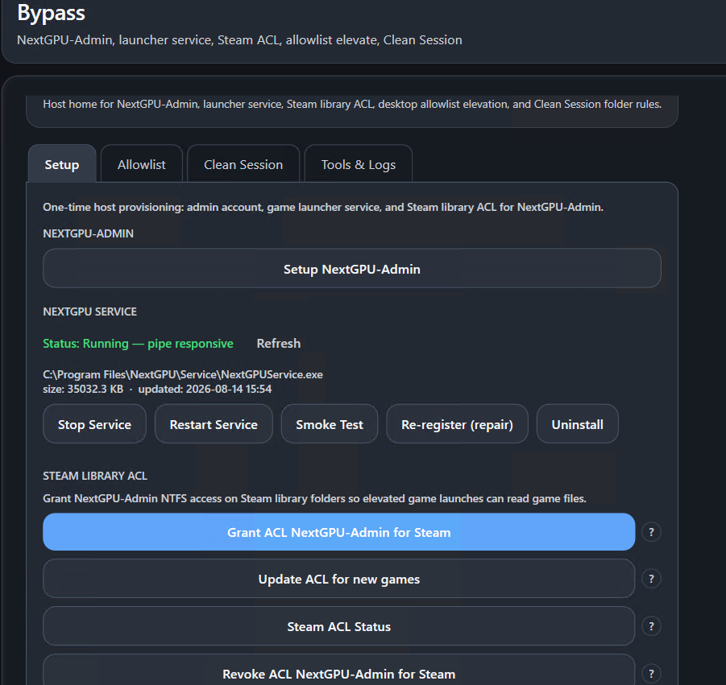

**NextGPU-Admin**

1. Click **Setup NextGPU-Admin**.
2. Verify status:
   - **User Account: Ready**
   - **Credential: Stored**
3. If both are green (normal after Register Machine), click **Cancel** — skip password entry and **Create & Store**.
4. If either status is missing, enter the Register Machine password (12+ characters) and click **Create & Store**.

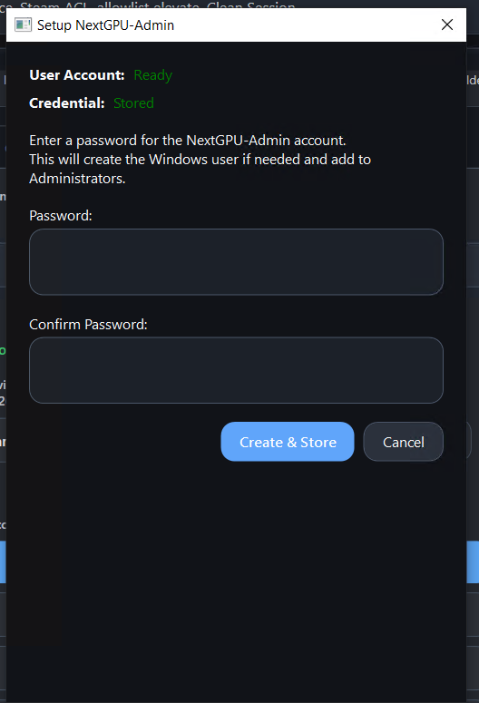

**NextGPU Service**

The service runs elevated game launches for renters. After Register Machine it should show **Running — pipe responsive**.

- **Refresh** — re-query install path and run state.
- **Smoke Test** — send a ping on the named pipe; use after install or repair.
- **Re-register (repair)** — re-run `Install-NextGPUService.ps1` if launches fail mysteriously.
- **Stop / Restart / Uninstall** — maintenance only; active Moonlight sessions cannot launch games while the service is down.

**Steam Library ACL**

Elevated Steam launches need NextGPU-Admin to read game files under the library.

| Button | Purpose |
| --- | --- |
| **Grant ACL NextGPU-Admin for Steam** | Full first-time apply on all resolved Steam libraries |
| **Update ACL for new games** | Re-scan after you install a new Steam title (safe anytime) |
| **Steam ACL Status** | Read-only report of library roots and ACL state |
| **Revoke ACL NextGPU-Admin for Steam** | Remove Admin ACEs (decommission / troubleshooting) |

#### Allowlist tab

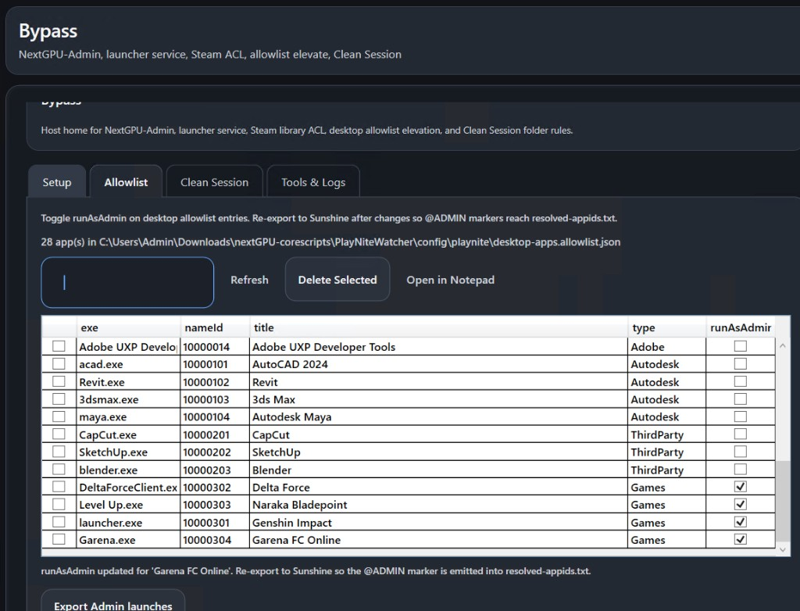

**What you're doing:** toggling **runAsAdmin** on desktop allowlist entries so those apps launch under NextGPU-Admin without a UAC prompt each rental.

1. Open the **Allowlist** tab. The grid lists apps from `desktop-apps.allowlist.json`.
2. Check **runAsAdmin** only for **assigned** titles that need admin (e.g. Garena FC Online, some anti-cheat games). Leave Adobe/Autodesk and unassigned rows unchecked unless NextGPU assigned them.
3. The footer reminds you to re-export after each toggle.
4. Click **Export Admin launches** — exports Playnite games + allowlist to Sunshine, installs PlayNiteWatcher, and restarts Sunshine. Confirm the warning; active Moonlight sessions may end.
5. If export fails, **close Playnite completely** and retry **Export Admin launches**. Only one Playnite instance can use `library\games.db` at a time.

**Grid tools:** filter by exe/title; **Refresh** reloads from disk; **Delete Selected** removes rows; **Open in Notepad** for bulk JSON edits.

#### Clean Session tab

Only when an assigned app needs its ProgramData or install folder reset each rental (e.g. Garena login state).

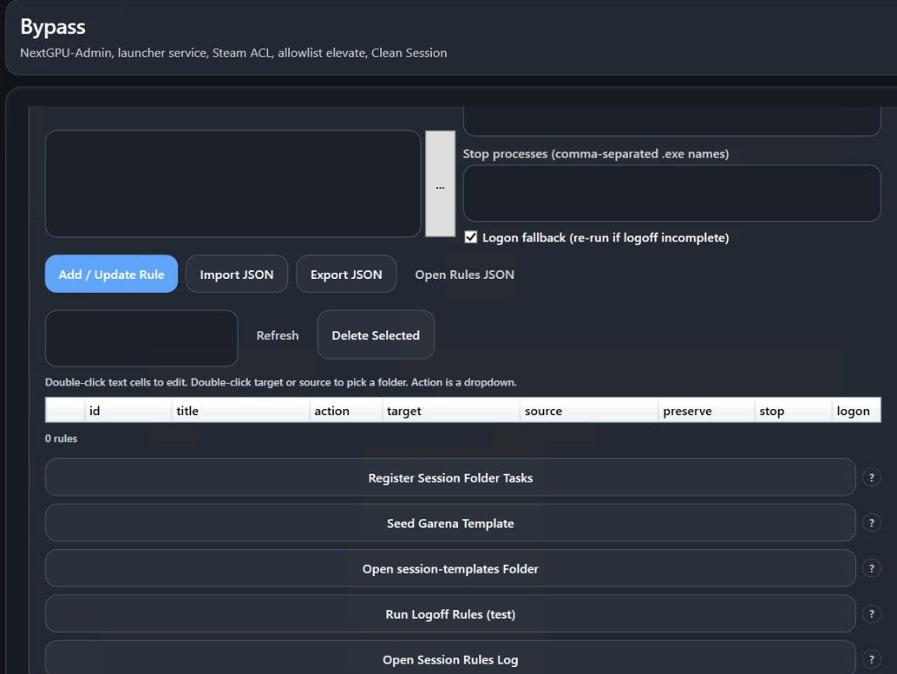

1. Click **Import JSON** and select the rules file NextGPU provided for this machine’s assigned apps.
2. Confirm the rules table (id, title, action, target, source, preserve, stop, logon). Double-click text cells to edit; double-click target/source to pick folders.
3. Click **Register Session Folder Tasks** and wait until the console confirms logoff and logon tasks are registered.

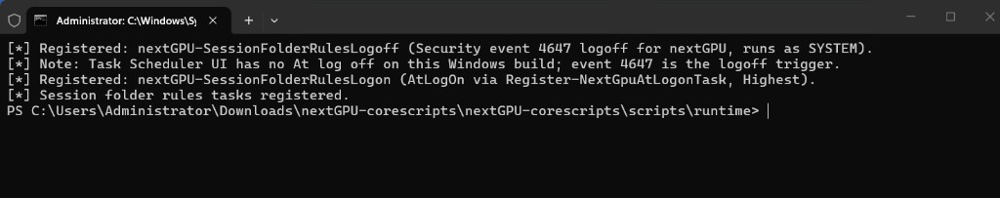

| Button | Purpose |
| --- | --- |
| **Seed Garena Template** | Copies Garena config into `session-templates` — skip if host layout already did this |
| **Open session-templates Folder** | Inspect golden replace sources |
| **Run Logoff Rules (test)** | Manual logoff-phase test (same as endSession STEP 0) |
| **Open Session Rules Log** | Read `session-folder-rules.log` |

> **Notice:** At session end, Clean Session folder rules run **and** `endSession` **deletes then recreates `NextGPU-Admin`** so elevated-launch state does not carry across rentals. Keep the Register Machine password; it is how the account comes back.

More detail: [session/clean-session.md](session/clean-session.md)

#### Tools & Logs tab

Shortcuts to **Open Steam Library Folder**, **Open ProgramData\\nextGPU**, **Open Session Rules Log**, **Open NextGPUService Log**, and **Open Admin Setup Log** — use when troubleshooting Step 6.3.

**What "success" looks like for Bypass:**

- **User Account: Ready** and **Credential: Stored** on Setup tab.
- NextGPUService **Running — pipe responsive**; Smoke Test passes.
- Steam ACL granted (Status shows expected libraries).
- **runAsAdmin** enabled only on assigned admin titles; **Export Admin launches** completed.
- Clean Session tasks registered when your assigned list requires folder reset rules.

### 4. Verify PlayNite Status

**Where:** Controller → **PlayNite** tab → **Verify PlayNite Status**

When Steps 6.1–6.3 are done, run this checklist before you move on.

1. Click **Verify PlayNite Status**.
2. For each result line:
   - **`[PASS]`** — that part of Step 6 is OK.
   - **`[FAIL]`** — something required is broken. Use the **→ Run:** action on that row (or repeat the sub-step it maps to), then click **Re-verify**.

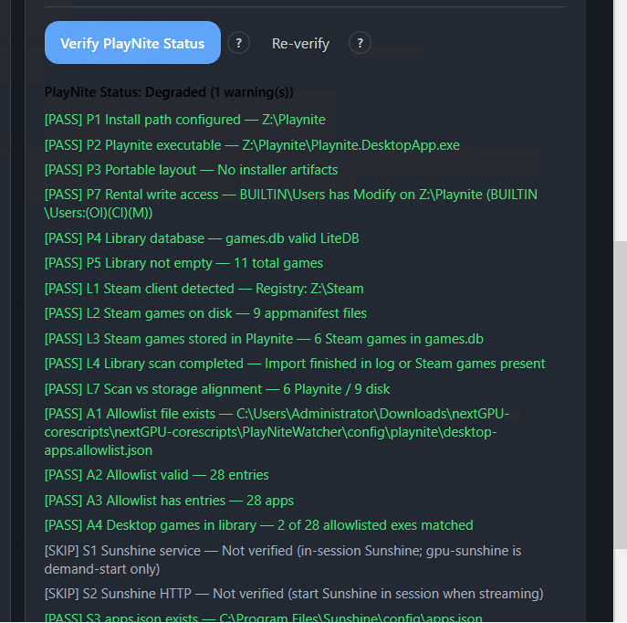

---

## Step 7: Final check before going live

**Controller STEP 07 — Verify Host Is Ready**

**Requires:** Step 6 finished, including **Push Moonlight Games to AWS** after **Setup Games & Apps**.

**What you're doing:** going through a short checklist to confirm everything from Steps 1–6 is actually working together, before you hand the machine off to a renter.

**Click:** `Run Wallpaper Verification`, then work through this list:


| #   | Check                           | What "good" looks like                                                                       |
| --- | ------------------------------- | -------------------------------------------------------------------------------------------- |
| 1   | Streaming starts                | Log in as `nextGPU`; a test stream connects through Moonlight without a black screen         |
| 2   | Wallpaper looks right           | The verification script reports `[OK]`, and the desktop image isn't stretched or cropped     |
| 3   | Drivers are present             | Virtual display and audio devices show up in Device Manager                                  |
| 4   | Background services are running | `cloudflared`, `moonlight-web`, `gpu-heartbeat`, and `auto-repair` are all listed as running |
| 5   | Renter storage works            | Log in as `nextGPU`; the `U:` drive appears with the right label                             |
| 6   | Games show up                   | The PlayNite-exported games appear in the Moonlight app list                                 |
| 7   | No alarming errors in the logs  | A quick skim of the recent logs doesn't show repeated failures                               |


### Test it like a renter would

1. Open `domain.txt`, copy the web address, and open it in a browser — ideally from a different device.
2. Confirm Moonlight Web loads, the machine shows up, and a test stream actually starts.

### One more reboot, then recheck

After everything passes once, reboot the machine one more time and recheck items 1, 4, and 5 specifically. Display setup and the `U:` drive are the two things most likely to behave differently after a cold boot versus right after setup — better to catch that now than after a renter is already connected.

Once all seven checks pass after that reboot, the machine is ready to list.

---

## If something goes wrong

Find the symptom you're seeing below.

### Black screen when streaming starts

**Likely cause:** the display software isn't fully warmed up yet.

**Try, in order:**

1. Open the Controller and use the option to start Sunshine within the active session (not as a background service).
2. From the **Sunshine** page, restart its API / refresh the display.
3. Re-apply the wallpaper.
4. If you just installed the virtual display driver, reboot — this is often the actual fix.

### Virtual display not showing up

#### Manual fix: point Sunshine at the VDD display

Use this when streaming shows a black screen, the wrong monitor, or Sunshine never picked up the virtual display automatically.

**Part 1 — Find the VDD `device_id`**

1. Make sure **Sunshine is running** (from the Controller **Sunshine** page, use **Restart Sunshine (Service)** if you're unsure).
2. Open a browser on the machine and go to `**https://localhost:47990`**.
  - Your browser will warn about the certificate — that's normal for a local Sunshine install. Choose **Advanced** → **Proceed to localhost** (wording varies by browser).
3. Open the **Troubleshooting** tab, then open the **Logs** section (Sunshine shows its log output here).
4. Press **Ctrl+F** (Find on page) and search for `**device_id`** inside the log text.
5. Look through the matches until you find the block for the **virtual display (VDD)**. You're on the right one when you see `"friendly_name": "VDD by MTT"` and `"primary": true` inside `"info"`.
  A correct VDD entry in the logs looks like this (your `device_id` and resolution may differ slightly):

```json
{
  "device_id": "{222d7a6c-39bc-5175-89c3-3ae777fe8f15}",
  "display_name": "\\\\.\\DISPLAY48",
  "edid": {
    "manufacturer_id": "MTT",
    "product_code": "1337",
    "serial_number": 518463207
  },
  "friendly_name": "VDD by MTT",
  "info": {
    "hdr_state": "Disabled",
    "origin_point": {
      "x": 0,
      "y": 0
    },
    "primary": true,
    "refresh_rate": {
      "type": "rational",
      "value": {
        "denominator": 1,
        "numerator": 120
      }
    },
    "resolution": {
      "height": 1440,
      "width": 2560
    },
    "resolution_scale": {
      "type": "rational",
      "value": {
        "denominator": 100,
        "numerator": 125
      }
    }
  }
}
```

1. Copy the `**device_id**` from that block — including the curly braces. From the example above, copy:
  `{222d7a6c-39bc-5175-89c3-3ae777fe8f15}`

> **Tip:** If several displays appear in the logs, always use the VDD entry with `**"primary": true`**. Physical monitors usually have different `friendly_name` values and are not what you want for headless streaming.

**Part 2 — Paste it into Sunshine**

1. In the same Sunshine web UI (`https://localhost:47990`), open the **Configuration** tab.
2. Go to **Audio/Video**.
3. Find **Display ID** (sometimes labeled **Output Name** in older builds).
4. Paste the `device_id` you copied.
5. Click **Save**, then **Apply** (or restart Sunshine from the Controller **Sunshine** page).

**What "success" looks like:** a test Moonlight stream shows the desktop on the virtual display, not a black screen. If it still fails, re-run **Sunshine API Restart** from the Controller and try streaming again.

### No audio during a stream

**Likely cause:** the virtual audio driver didn't install correctly (common on some Windows 11 24H2 machines).

**Fix:** In the Controller, open the **VDD/VAD** page and click **Install VAD Fallback**. Let it finish, then start a new test stream and check audio again.

### "rclone install failed" warning, but things seem to work

This usually means the tool was already installed and the installer just reported it oddly. Open a terminal and type `rclone version` — if that shows a version number, it's fine, ignore the warning.

### Desktop wallpaper looks wrong or icons are visible

1. Re-run the wallpaper setup option.
2. Run the wallpaper verification check.
3. If using Moonlight/virtual display, make sure Sunshine was started within the session — the wallpaper sometimes applies on a short delay tied to that.

### Can't shrink the drive in Step 2

Turn off hibernation, move or shrink the page file, and clear System Restore points on that drive — then reboot and try again. (Same fix as in Step 2 above, repeated here since it's the most common stuck point.)

### PlayNite imported zero games

**Likely cause:** the game-finding tool isn't running, or your drives haven't been indexed.

**Try:** start the "Everything" search tool, let it index your drives, then re-run the import from the PlayNite tab.

### Renter storage (U:) missing

1. Open **User Storage** → **Diagnose & fix**.
2. Try **Mount U: for Moonlight**.
3. If that doesn't work, re-run **Step 5 (One-Click S3 Setup)** — no reboot needed for this one.

### Push Moonlight Games to AWS failed

**Likely causes:** Moonlight Web is not running, no games were exported yet, or `domain.txt` is incomplete.

**Try, in order:**

1. Confirm the `moonlight-web` service is running (Step 7, checklist item 4).
2. Confirm games appear in the Moonlight app list locally (Step 6 / Step 7, checklist item 6).
3. Open `domain.txt` and verify `COMPUTER_NAME=` and `PUBLIC_IP=` are filled in.
4. Re-run **Push Moonlight Games to AWS** from **Setup Games & Apps** → **Host Setup** tab.
5. **If it still fails:** open `**https://localhost:47990`** in a browser (accept the certificate warning if prompted), go to the **Troubleshooting** tab, and **restart Sunshine**. Then try **Push Moonlight Games to AWS** again.

---

## Glossary

Quick definitions if a term in this guide is unfamiliar.


| Term                      | Plain-English meaning                                                                              |
| ------------------------- | -------------------------------------------------------------------------------------------------- |
| **Sunshine**              | The software running on this PC that captures the screen and streams it out.                       |
| **Moonlight**             | The viewer app a renter uses to watch and control the stream.                                      |
| **Virtual display / VDD** | Software that makes Windows think a monitor is plugged in, even when nobody's physically there.    |
| **Virtual audio / VAD**   | Same idea, but for speakers/audio output.                                                          |
| **Cloudflare Tunnel**     | A way to give this machine a public web address without configuring your router.                   |
| **rclone / WinFsp**       | Background tools that let a cloud storage bucket appear as a normal drive letter in Windows.       |
| **PlayNite**              | A game/app library manager that finds installed games/apps and lists them for streaming.           |
| `**domain.txt`**          | A file created after Step 4 containing this machine's public web address.                          |
| `**NextGPU-Authority`**   | Your original admin account, renamed — the only account that can shut down or restart the machine. |
| `**nextGPU`** (account)   | The everyday account renters actually use during their session.                                    |


---

## Where to find things later

### Key logs

If you need to dig into a problem, these are the most useful files (all inside your setup folder unless noted otherwise):


| Log file                                        | What it tells you                                                        |
| ----------------------------------------------- | ------------------------------------------------------------------------ |
| `logs\register_api_log.txt`                     | What was sent to nextGPU's servers during Step 4, and how they responded |
| `logs\VDD-VAD.log`                              | Virtual display/audio driver install details                             |
| `logs\heartbeat.log`                            | Ongoing status updates from this machine                                 |
| `logs\auto-repair.log`                          | Anything the machine fixed automatically on its own                      |
| `logs\sync-games-apps-*.log`                    | Details from the Step 3 game download                                    |
| `%ProgramData%\nextGPU\logs\user-storage-*.log` | Renter storage (`U:`) connection details                                 |


### Other guides in this repo


| Document                                    | What's in it                                                               |
| ------------------------------------------- | -------------------------------------------------------------------------- |
| `README.md`                                 | Technical internals — useful once you're comfortable and want to go deeper |
| `user-storage-recreate-flow.md`             | What to do if you delete and recreate the `nextGPU` account                |
| `PlayNiteWatcher/docs/Playnite-EndToEnd.md` | Full detail on the PlayNite automation                                     |


### If you ever need to undo everything

Preview what would be removed, without actually removing it:

```
uninstall-all.bat whatif
```

Actually remove everything:

```
uninstall-all.bat force
```

This does **not** remove your Cloudflare DNS/tunnel or rename `NextGPU-Authority` back — those need to be cleaned up separately if you want them gone too. Reboot after uninstalling.