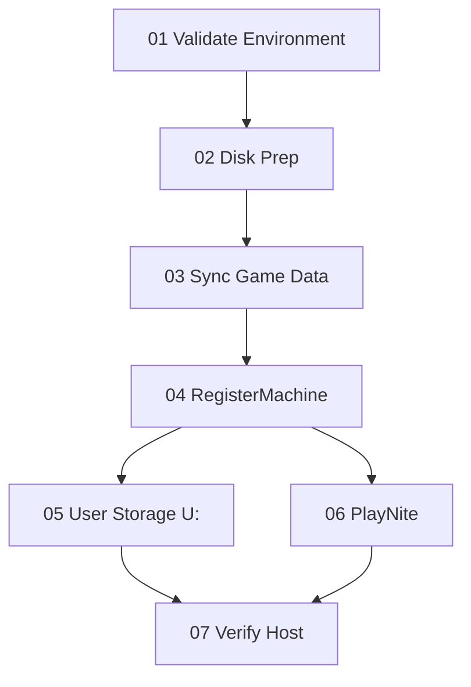

# nextGPU Machine Setup Guide

Complete end-to-end guide for provisioning a Windows GPU rental host. This document mirrors the **Get Started** flow in the **NextGPU Controller** desktop app and expands each step with prerequisites, commands, verification, and troubleshooting.

Use this guide when setting up a fresh machine or re-provisioning an existing host. For a shorter orientation, see `[started.md](started.md)`. For RegisterMachine internals (phases, services, APIs), see `[register-machine.md](register-machine.md)`.

---

## Table of contents

1. [Before you begin](#before-you-begin)
2. [Install the NextGPU Controller (recommended)](#install-the-nextgpu-controller-recommended)
3. [Step 01 — Validate environment](#step-01--validate-environment)
4. [Step 02 — Disk prep](#step-02--disk-prep)
5. [Step 03 — Sync official game data](#step-03--sync-official-game-data)
6. [Step 04 — Provision full host](#step-04--provision-full-host)
7. [Step 05 — Per-user S3 storage (U:)](#step-05--per-user-s3-storage-u)
8. [Step 06 — Implement PlayNite](#step-06--implement-playnite)
9. [Step 07 — Verify host is ready](#step-07--verify-host-is-ready)
10. [Post-setup operations](#post-setup-operations)
11. [Troubleshooting](#troubleshooting)
12. [Reference](#reference)

---

## Before you begin

### Target machine requirements


| Requirement    | Details                                                                                                                                |
| -------------- | -------------------------------------------------------------------------------------------------------------------------------------- |
| **OS**         | Windows 10/11 x64 (Server images supported; some VAD installs may fail on Win11 24H2 / Server 2025)                                    |
| **GPU**        | NVIDIA GPU recommended for game streaming                                                                                              |
| **Network**    | Outbound HTTPS to GitHub, Cloudflare, AWS API Gateway, and public IP lookup                                                            |
| **Privileges** | Administrator for all provisioning steps                                                                                               |
| **Tools**      | PowerShell 5.1+, `curl.exe` (or PowerShell download fallback), **7-Zip** at `C:\Program Files\7-Zip\7z.exe` for game sync and PlayNite |
| **Disk space** | Enough free space on a data volume (typically `**Z:`**) for games and apps                                                             |


### Repo placement

1. Download and extract the register file via link: [RegisterMachine.zip](https://github.com/bluefml1/nextGPU-corescripts/releases/latest/download/RegisterMachine.zip) 
2. Do **not** move the repo after PlayNite setup — paths and manifests depend on a stable location.
3. Keep the repo on a local fixed drive (not a network share during provisioning).

### Credentials to prepare (Step 04)

Have these ready **before** running RegisterMachine:


| Input                      | Purpose                                                          |
| -------------------------- | ---------------------------------------------------------------- |
| **Cloudflare API Token**   | Create/manage tunnels and DNS for `next-gpu.com`                 |
| **Cloudflare Account ID**  | Account that owns the tunnel                                     |
| **API Key**                | `x-api-key` header for the `registerMachine` Lambda              |
| **Computer Name**          | Display name (e.g. `NEXTGPU-105`);                               |
| **Original Price**         | Listing price (e.g. `4000`)                                      |
| **Vendor ID** *(optional)* | Sent as `vendor_id` in registration payload; press Enter to skip |
| **Admin account username** | Existing local admin renamed to `**NextGPU-Authority`**          |


For **Step 05** (user storage), also prepare:


| Input                                                               | Purpose                                                                                                           |
| ------------------------------------------------------------------- | ----------------------------------------------------------------------------------------------------------------- |
| `**NEXTGPU_USER_S3_ACCESS_KEY`** / `**NEXTGPU_USER_S3_SECRET_KEY`** | Machine env vars, **or** copy `scripts/runtime/user-s3.env.example` → `%ProgramData%\nextGPU\secrets\user-s3.env` |


Never commit real tokens or S3 keys to git.

### Accounts created by provisioning


| Account                 | Role                                                                |
| ----------------------- | ------------------------------------------------------------------- |
| `**NextGPU-Authority`** | Former admin; only account allowed to shut down/restart the machine |
| `**nextGPU`**           | Standard rental user; Moonlight sessions, desktop cleanup, U: mount |


---

## Install the NextGPU Controller (recommended)

The **NextGPU Controller** is a Windows desktop app that runs the same scripts as this guide with one-click buttons, health dashboard, and log tailing.

### Quick launch

1. On the GPU PC, open the repo folder.
2. Double-click `**NextGPU.bat`** (repo root).
3. Sign in:


| Field    | Value        |
| -------- | ------------ |
| Username | `bluefml1`   |
| Password | `letmeinpls` |


---

## Step 01 — Validate environment

**Goal:** Confirm the repo layout is complete before any destructive provisioning.

**UI actions:** **Run Layout Test** · **Open Settings**

### What it checks

`scripts\maintenance\Test-NextGpuLayout.ps1` verifies:

- Root launchers: `RegisterMachine_Beta.bat`, `uninstall-all.bat`
- Provisioning, runtime, desktop, task, and user-storage scripts
- Wallpaper asset: `assets\nextgputobu.jpeg`
- Optional PlayNiteWatcher files (required only for Step 06)
- Helper load test for `DefaultUserHive.ps1` and shutdown policy scripts

### Run manually

```powershell
powershell -ExecutionPolicy Bypass -File scripts\maintenance\Test-NextGpuLayout.ps1
```

Or from repo root with env override:

```bat
set NEXTGPU_REPO_ROOT=C:\path\to\nextGPU-corescripts
powershell -ExecutionPolicy Bypass -File scripts\maintenance\Test-NextGpuLayout.ps1
```

### Success criteria

- All required paths show `**[OK]**`
- Final message: **"All layout checks passed"**
- Exit code `0`

### If it fails

- Re-copy the **full** repo; partial copies are the most common cause.
- Ensure you are on **Windows** (not running the test from Linux/macOS).
- Fix any `**[FAIL]`** paths before continuing.

---

## Step 02 — Disk prep

**Goal:** Repair filesystem errors, then prepare a data volume (typically `**Z:`**) for games and session scripts.

**UI actions:** **Open Disk Management** · **Run CHKDSK Repair**

### 2a. CHKDSK repair

Repairs filesystem errors before shrinking partitions.

```bat
scripts\maintenance\Run-ChkDsk-Repair.ps1
```

- GUI prompts: check **one drive** or **all fixed drives**
- Runs `chkdsk X: /f` and may schedule repairs on next reboot
- **Reboot** if prompted before partition work

### 2b. Shrink and extend / create data volume

From **Disk Management** page → **Shrink Volume (Extend Existing or Create New)**:

```bat
scripts\maintenance\Create-Z-Partition.ps1
```

Workflow:

1. Choose **source drive** to shrink (often `C:`)
2. Enter **size in GB** to take from source
3. Choose mode:
  - **Extend existing volume** — e.g. add freed space to existing `**Z:`** (only works when target partition is immediately adjacent on disk)
  - **Create new partition** — assign a new drive letter

After a successful shrink/extend/create, the script applies data-drive ACLs on the target volume:

- **BUILTIN\Users** — allow read/execute `(OI)(CI)(RX)`
- **NextGPURestricted** — deny delete `(OI)(CI)(DE,DC)` (rental account **nextGPU** is added to this group during RegisterMachine and session recreate)

Disk prep may run before **nextGPU** exists; the **NextGPURestricted** group is created at ACL time if missing.

### Expected layout after disk prep


| Drive    | Typical use                                                  |
| -------- | ------------------------------------------------------------ |
| `**C:`** | OS                                                           |
| `**Z:`** | Games, Adobe, Garena, `launchGame.ps1`, sync extract targets |
| `**U:`** | Per-user tenant storage (mounted later in Step 05)           |


### If shrink fails

- Disable **hibernation**: `powercfg /h off`
- Reduce or move **page file** off the source drive
- Clear **System Restore** points on that volume
- **Reboot**, then retry from Disk Management

---

## Step 03 — Sync official game data

**Goal:** Download official game/app archives from Cloudflare R2, extract to data drives, and write a reusable manifest for PlayNite and Steam layout.

**UI actions:** **Sync Game/Apps** · **Open User Experience**

### Prerequisites

- **7-Zip** installed at `C:\Program Files\7-Zip\7z.exe`
- **rclone** and **WinFsp** (script installs via winget if missing)
- R2 remote configured as `**r2games`** (script handles first-time setup)
- Adequate free space on target drive(s)

### Run sync

```bat
scripts\maintenance\sync-games-apps-official.bat
```

This invokes `Sync-GamesApps-Official.ps1`, which:

1. Lists objects on R2 (`next-gpu-storage-app` bucket path)
2. Lets you pick archives to download (or install all with flags)
3. Downloads with progress, speed, and ETA logging
4. Extracts `.zip`/`.7z` into per-archive folders on disk
5. Appends `**sync-games-apps-downloaded.txt**` manifest (used by PlayNite Steam discovery and Steam layout tools)

### Logs

- `logs\sync-games-apps-YYYYMMDD-HHmmss.log`
- Manifest may also appear on data drives: `X:\NextGPU-Sync\sync-games-apps-downloaded.txt`

### Success criteria

- Selected archives extracted to intended folders (e.g. `Z:\Steam`, `Z:\Adobe`)
- Manifest file updated with download/extract entries
- No `**[FAIL]**` lines in the sync log

### Notes

- **winget** may return non-zero exit when rclone/WinFsp is already installed — continue if tools are detected.
- Remote preflight warnings with listed S3 items are treated as warnings when output is present.
- Re-run sync after adding new official releases to R2.

---

## Step 04 — Provision full host

**Goal:** Full one-time host provisioning — VDD/VAD, Sunshine, Moonlight Web, Cloudflare Tunnel, AWS registration, background services, wallpaper, and local accounts.

**UI actions:** **Run RegisterMachine** · **Open Provisioning Logs**

> **Use the UI first.** Step 04 is the longest and most interactive step. Always run it from the **NextGPU Controller** when the app is available. Manual batch execution is a **fallback** only (headless hosts, broken UI, or remote troubleshooting).

### Primary — Run from NextGPU Controller (recommended)

1. Launch `**NextGPU.bat`** or `**NextGPU.exe`** from the repo root and sign in.
2. Open **Get Started** (sidebar).
3. On **Step 04 — Provision Full Host**, click **Run RegisterMachine**.
  - The app elevates via UAC and opens an elevated console with output kept visible (`keepConsoleOpen`).
  - Enter Cloudflare token, account ID, API key, computer name, price, optional vendor ID, and admin username when prompted.
  - Confirm the summary with **Y** to continue.
4. While provisioning runs, use **Open Provisioning Logs** (secondary button on the same step) or the **Logs** page to tail `sunshine-bind.log`, `VDD-VAD.log`, and `register_api_log.txt`.
5. When the console finishes, follow [After RegisterMachine](#after-registermachine) below.

### Fallback — Run manually

Use only if the NextGPU app is unavailable or fails to launch the script:

```bat
RegisterMachine_Beta.bat
```

Right-click → **Run as administrator** (or run from an elevated prompt). The script auto-elevates if started without admin rights.

### What RegisterMachine does (summary)


| Phase             | Actions                                                                                    |
| ----------------- | ------------------------------------------------------------------------------------------ |
| **0 — Config**    | Admin check, interactive prompts, WMI/CIM probe                                            |
| **1 — VDD/VAD**   | Virtual Display + Virtual Audio drivers; Virtual Driver Control app                        |
| **2 — Streaming** | Sunshine install, Moonlight Web service, Moonlight ↔ Sunshine pairing, ViGEmBus            |
| **3 — Tunnel**    | cloudflared download, tunnel + DNS on `{id}.next-gpu.com`, `cloudflared` service           |
| **4 — Register**  | Hardware inventory, benchmarks, game list, `POST registerMachine`, write `**domain.txt`**  |
| **5 — Services**  | `gpu-heartbeat`, `auto-repair`, scheduled tasks (EndSession, game launch)                  |
| **6 — Finish**    | Wallpaper policy, rename admin → `NextGPU-Authority`, create `nextGPU` user, shutdown lock |


### Key outputs


| File / artifact                 | Contents                                                                         |
| ------------------------------- | -------------------------------------------------------------------------------- |
| `**domain.txt`**                | `DOMAIN`, `PUBLIC_IP`, `COMPUTER_NAME` — required for heartbeat and user storage |
| `**logs/register_api_log.txt`** | Registration payload and API response                                            |
| `**logs/VDD-VAD.log`**          | Virtual driver install log                                                       |
| `**logs/sunshine-bind.log**`    | Sunshine display binding (if present)                                            |


### Windows services installed


| Service         | Purpose                                   |
| --------------- | ----------------------------------------- |
| `moonlight-web` | Browser client on `http://127.0.0.1:8080` |
| `cloudflared`   | Public HTTPS tunnel to Moonlight          |
| `gpu-heartbeat` | Status updates every 300 s                |
| `auto-repair`   | Self-healing every 60 s                   |


Sunshine runs in the **logged-on user session** via scheduled task `nextGPU-SunshineLogon`, not as a persistent LocalSystem service.

### After RegisterMachine

1. **Reboot manually** when prompted — drivers, display paths, and account renames apply more reliably after restart.
2. Confirm services: `sc query cloudflared`, `sc query moonlight-web`, `sc query gpu-heartbeat`, `sc query auto-repair`
3. Open the URL from `**domain.txt`** and confirm Moonlight Web loads.
4. **RDP or console logon once** after reboot so Sunshine can enumerate the virtual display.

### Static defaults (embedded)


| Setting                      | Value                     |
| ---------------------------- | ------------------------- |
| Moonlight ingress            | `http://127.0.0.1:8080`   |
| Public DNS zone              | `next-gpu.com`            |
| Sunshine credentials (setup) | `bluefml1` / `letmeinpls` |


---

## Step 05 — Per-user S3 storage (U:)

**Goal:** Mount tenant personal storage as `**U:`** for the `**nextGPU`** rental user (~22 s after sign-in).

**Prerequisite:** Step 04 completed and `**domain.txt`** exists.

**UI actions:** **One-Click S3 Setup** · **Open User Storage Page**

### One-time setup (Administrator)

```bat
scripts\runtime\User-Storage.bat Setup
```

This:

1. Installs **rclone** and **WinFsp** if missing
2. Writes `%ProgramData%\nextGPU\rclone\rclone.conf`
3. Publishes mount scripts to `%ProgramData%\nextGPU\scripts\runtime\`
4. Registers scheduled tasks:
  - `**nextGPU-UserStorageEnsureBindings`** — logon +0 s (SYSTEM)
  - `**nextGPU-UserStorageMount`** — logon +22 s (nextGPU)
5. Grants **nextGPU** read access to `domain.txt` and runtime scripts

### Credentials

Set **one** of:

```bat
setx NEXTGPU_USER_S3_ACCESS_KEY "AKIA..." /M
setx NEXTGPU_USER_S3_SECRET_KEY "..." /M
```

Or copy and fill:

```
%ProgramData%\nextGPU\secrets\user-s3.env
```

(from `scripts/runtime/user-s3.env.example`)

### Verify (log on as nextGPU)

1. Sign in as `**nextGPU**` (Moonlight session or local)
2. Wait ~22 seconds
3. `**U:**` appears with label like `**{Name}'s Storage**` (from checkDomain API)
4. Logs: `%ProgramData%\nextGPU\logs\user-storage-mount.log`

### Admin RDP + Moonlight (single session)

When operating from **NextGPU-Authority** RDP while Moonlight connects as nextGPU:

```bat
scripts\runtime\Mount-UserStorage-Now.bat
```

Or use **User Storage** page → **Diagnose & fix** → **Mount U: for Moonlight**.

### After recreating the nextGPU user

Do **not** re-run Setup. Run:

```bat
scripts\runtime\User-Storage.bat Sync
```

See `[user-storage-recreate-flow.md](user-storage-recreate-flow.md)` for the full recreate sequence.

---

## Step 06 — Implement PlayNite

**Goal:** Install portable PlayNite, import Steam/Epic libraries and desktop apps, export games to Sunshine, and install PlayNiteWatcher for session lifecycle.

**Prerequisite:** Step 04 completed (Sunshine must exist).

**UI actions:** **Run PlayNite Setup** · **Open PlayNite Tab**

### Prerequisites


| Requirement                 | Details                                                                                                     |
| --------------------------- | ----------------------------------------------------------------------------------------------------------- |
| **7-Zip or WinRAR**         | Extract Playnite portable `.7z`                                                                             |
| **Steam and/or Epic**       | Games installed on disk (disk scan, no login required)                                                      |
| **Everything** *(optional)* | For desktop app allowlist import; index data drives                                                         |
| **Allowlist** *(optional)*  | Copy `config\playnite\desktop-apps.allowlist.json.template` → `config\playnite\desktop-apps.allowlist.json` |


### Run setup

```bat
PlayNiteWatcher\Setup-PlayniteSteam.bat
```

Equivalent to:

```powershell
Setup-PlayniteSteam.ps1 -PickInstallFolder -WithSunshine
```

Workflow:

1. Pick install parent folder (e.g. `D:\Games` → installs to `D:\Games\Playnite`)
2. Download/extract portable PlayNite
3. Install Steam/Epic builtin library extensions
4. Update libraries from disk (`--updatelibraries`)
5. Import desktop apps from allowlist (if configured)
6. Export to Sunshine `**apps.json**`
7. Install **PlayNiteWatcher** for auto-close on game exit
8. **Push Moonlight games to AWS** using `domain.txt` (automatic; requires RegisterMachine / `domain.txt`)

Path saved in `**PlayNiteWatcher\PlayniteInstall.path`**.

Skip AWS push only when needed:

```powershell
Setup-PlayniteSteam.ps1 -PickInstallFolder -WithSunshine -SkipAwsPush
```

### After new games are installed

```bat
PlayNiteWatcher\Update-PlayniteLibraries.bat
```

Then re-export from the **PlayNite** tab or run Sunshine stack update with `-RefreshPlayniteLibrary`, then **Push Moonlight Games to AWS** from **User Experience** (or re-run full setup export).

### Success criteria

- `PlayniteInstall.path` exists
- `library\games.db` contains imported titles
- Sunshine `apps.json` includes PlayNite-exported games
- PlayNiteWatcher installed (verify on PlayNite tab)
- AWS `updateNewGame` API reports success in `Setup-PlayniteSteam.log` (auto on `-WithSunshine`)

Full PlayNite details: `[playnitewatcher/end-to-end.md](playnitewatcher/end-to-end.md)`.

---

## Step 07 — Verify host is ready

**Goal:** Confirm the machine is production-ready before handing off to renters.

**UI actions:** **Run Wallpaper Verification** · **Open Logs Page**

### Verification checklist

Complete every item that applies to your deployment:


| #   | Check                              | How to verify                                                                                                                                      |
| --- | ---------------------------------- | -------------------------------------------------------------------------------------------------------------------------------------------------- |
| 1   | **Sunshine session starts**        | Log on as nextGPU; Sunshine process running; stream connects via Moonlight                                                                         |
| 2   | **Wallpaper policy applied**       | Run `scripts\desktop\Test-WallpaperPolicy.ps1` — look for `**[OK] WallpaperStyle = 6`** (Fit), desktop path to `**nextgputobu-4k.bmp`** or 4K JPEG |
| 3   | **Required drivers exist**         | VDD: `DISPLAY\MTT1337`* device; VAD playback device (optional); ViGEmBus installed                                                                 |
| 4   | **Key services healthy**           | `cloudflared`, `moonlight-web`, `gpu-heartbeat`, `auto-repair` all running                                                                         |
| 5   | **U: tenant storage** *(Step 05)*  | Log on as nextGPU; `U:` mounted with correct label                                                                                                 |
| 6   | **Sunshine apps.json** *(Step 06)* | PlayNite-exported games visible in Moonlight app list                                                                                              |
| 7   | **No critical log errors**         | Review `logs\register_api_log.txt`, `logs\auto-repair.log`, `logs\heartbeat.log`, provisioning logs                                                |


### Wallpaper verification

```powershell
powershell -ExecutionPolicy Bypass -File scripts\desktop\Test-WallpaperPolicy.ps1
```

Expected:

- `**[OK] WallpaperStyle = 6**` on desktop (Fit — full image visible)
- **No** `WallpaperStyle = 10` (Fill/crop)
- Scheduled task `**nextGPU-WallpaperFitLogon`** registered

### Dashboard quick checks (NextGPU app)

Open **Dashboard** and confirm:

- `**domain.txt`** parsed correctly
- Moonlight `http://127.0.0.1:8080` returns OK
- Sunshine `https://localhost:47990` reachable
- VDD/VAD status green where applicable

### Public URL test

1. Read `**domain.txt`** → open `https://{DOMAIN}/`
2. Moonlight Web loads; host appears; test stream starts

### Reboot test

After first successful verification, **reboot once** and repeat checks 1, 4, and 5 — display binding and U: mount are most sensitive to cold boot order.

---

## Post-setup operations

### Refresh game list on backend

```bat
scripts\maintenance\updateGames.bat
```

Run after Sunshine/Moonlight apps change.

### Manual streaming stack repair

```bat
scripts\runtime\auto-repair.bat
```

Skips repair when `domain.txt` contains `STATUS=updating`.

### Streaming stack update

```bat
scripts\runtime\Run-StreamingStackUpdate.bat
```

Shared Sunshine/Moonlight update and pairing path used by auto-repair and auto-update.

### Apply wallpaper only

```bat
scripts\desktop\Setup-Wallpaper.bat
```

Requires `assets\nextgputobu.jpeg` in the repo.

### Uninstall

Preview:

```bat
uninstall-all.bat whatif
```

Full uninstall:

```bat
uninstall-all.bat force
```

Does **not** remove Cloudflare DNS/tunnel resources or `**NextGPU-Authority`**. Reboot after uninstall.

---

## Troubleshooting

Issues below match the **Troubleshooting** section in the NextGPU **Get Started** page.

### Black screen in Moonlight/session stream

**Cause:** Display stack not fully ready.

**Fix:**

1. Start Sunshine in the user session: `scripts\provisioning\Start-Sunshine-InSession.ps1`
2. Run Sunshine API restart / display refresh from **Sunshine** page
3. Re-apply wallpaper after display is ready
4. Reboot if VDD was just installed

### VDD virtual display not detected

**Cause:** Driver not installed or wrong Sunshine output binding.

**Fix:**

1. Reinstall: `scripts\drivers\InstallVDD-VAD.bat`
2. Reboot
3. Probe devices: `scripts\provisioning\Get-DisplayDeviceId.ps1 -ListAll -IncludeInactive`
4. Verify Sunshine `output_name` in **VDD-VAD** / **Sunshine** pages
5. Check `logs\VDD-VAD.log`, `logs\sunshine-vdd-setup.log`

### VAD virtual audio not detected / no stream audio

**Fix:**

1. Reinstall VAD via **Install VDD/VAD**
2. Validate Windows default playback device
3. Re-run RegisterMachine or full driver install if audio services incomplete

Note: VAD is non-blocking on some Windows 11 24H2 images (Code 52).

### rclone/WinFsp install warning after success

**Cause:** winget non-zero exit when package already installed.

**Fix:** Confirm `rclone version` and WinFsp in Programs; re-run sync if tools are present.

### Remote preflight fails but S3 items are listed

**Fix:** Treat as warning when listing works. If listing is empty, verify R2 credentials and bucket name.

### Wallpaper cropped or desktop icons visible

**Fix:**

1. `scripts\desktop\Setup-Wallpaper.bat`
2. `scripts\desktop\Test-WallpaperPolicy.ps1`
3. For Moonlight/VDD: start Sunshine in-session so delayed wallpaper apply runs

### Sunshine API restart / TLS error

**Cause:** Self-signed localhost TLS breaks raw curl calls.

**Fix:** Use `scripts\provisioning\Start-Sunshine-InSession.ps1` and **Sunshine** page API restart helper.

### Cannot shrink partition during disk prep

**Fix:** Disable hibernation, pagefile, restore points → reboot → retry **Disk Management** shrink.

### PlayNite desktop import added 0

**Cause:** Everything IPC failed, drive not indexed, or allowlist missing.

**Fix:**

1. Start **Everything** service; index data drives
2. Edit `config\playnite\desktop-apps.allowlist.json`
3. Re-run import from **PlayNite** tab

### PlayNite Sunshine export empty

**Cause:** Empty or stale `library\games.db`.

**Fix:**

1. Confirm Steam/Epic games on disk
2. `PlayNiteWatcher\Update-PlayniteLibraries.bat`
3. Export to Sunshine from **PlayNite** tab

### Moonlight stream does not auto-close after game exit

**Cause:** PlayNiteWatcher or `eventLogs.ps1` missing.

**Fix:** **PlayNite** tab → **Verify PlayNite Status** → **Install PlayNiteWatcher**

### U: tenant storage missing (Admin RDP + Moonlight)

**Fix:**

1. **User Storage** page → **Diagnose & fix** (ACL + WinFsp + checkDomain)
2. **Mount U: for Moonlight**
3. If WinFsp missing: `User-Storage.bat Setup` again (no reboot required)

### checkDomain API failed in troubleshoot

**Fix:** API requires GET + JSON body (fixed in latest `UserStorageCommon.ps1`). Test with curl or **Diagnose** on User Storage page.

---

## Reference

### Recommended setup order




Steps **05** and **06** both require **04**; they can run in either order. **07** runs last.

### Key log files


| Log                                             | Purpose                         |
| ----------------------------------------------- | ------------------------------- |
| `logs\setup_log_YYYYMMDD.txt`                   | RegisterMachine start timestamp |
| `logs\wmi-probe.log`                            | WMI/CIM probe                   |
| `logs\VDD-VAD.log`                              | Virtual drivers                 |
| `logs\register_api_log.txt`                     | Backend registration            |
| `logs\heartbeat.log`                            | Status updates                  |
| `logs\auto-repair.log`                          | Self-healing actions            |
| `logs\sunshine-vdd-setup.log`                   | Sunshine VDD output binding     |
| `logs\sync-games-apps-*.log`                    | R2 game sync                    |
| `%ProgramData%\nextGPU\logs\user-storage-*.log` | U: mount/ensure                 |
| `PlayNiteWatcher\Setup-PlayniteSteam.log`       | PlayNite setup                  |
| `logs\nextgpu-controller.log`                   | NextGPU app audit log           |


### Scheduled tasks (nextGPU-*)


| Task                                | Trigger               | Purpose                                   |
| ----------------------------------- | --------------------- | ----------------------------------------- |
| `nextGPU-SunshineLogon`             | nextGPU logon         | Start Sunshine in session                 |
| `nextGPU-WallpaperFitLogon`         | Logon                 | Re-apply Fit wallpaper                    |
| `nextGPU-DesktopCleanupLogon`       | nextGPU logon         | Clear nextGPU desktop                     |
| `nextGPU-UserStorageEnsureBindings` | nextGPU logon +0 s    | Re-bind storage tasks after user recreate |
| `nextGPU-UserStorageMount`          | nextGPU logon +22 s   | Mount U:                                  |
| `EndSession`                        | Application log event | Sunshine session end                      |


### External downloads (runtime)


| Asset             | Source                                  |
| ----------------- | --------------------------------------- |
| Sunshine          | `github.com/bluefml1/nextGPU-sunshine`  |
| Moonlight Web     | `github.com/bluefml1/nextGPU-moonlight` |
| cloudflared       | Cloudflare releases                     |
| NSSM              | GitHub (NssmService)                    |
| VDD/VAD           | VirtualDrivers GitHub releases          |
| PlayNite portable | Playnite GitHub releases                |


### Security reminders

- Do not commit Cloudflare tokens, API keys, tunnel tokens, or S3 credentials.
- `CLOUDFLARE_TUNNEL_TOKEN` is stored as a machine environment variable.
- Default Sunshine/Moonlight credentials are for automated pairing — rotate for production hardening if needed.
- Review `logs/register_api_log.txt` before sharing logs externally.

### Related documentation


| Document                                                                                       | Contents                               |
| ---------------------------------------------------------------------------------------------- | -------------------------------------- |
| `[started.md](started.md)`                                                                     | Fast orientation                       |
| `[register-machine.md](register-machine.md)`                                                                       | RegisterMachine phases, services, APIs |
| `[user-storage-recreate-flow.md](user-storage-recreate-flow.md)`                               | U: mount after nextGPU user recreate   |
| `[playnitewatcher/end-to-end.md](playnitewatcher/end-to-end.md)` | PlayNite automation details            |
| `[nextgpu-app/README.md](nextgpu-app/README.md)`                                       | NextGPU Controller build and deploy    |


