# nextGPU Setup (Beginner — Visual Guide)

> Screenshot walkthrough. Full explanations and troubleshooting: [machine-setup-beginer.md](machine-setup-beginer.md)

**Start here if you want pictures for every click.** Time estimate: 1–2 hours including reboots.

---

## Table of contents

1. [Before you start](#before-you-start)
2. [Optional: clean the machine](#optional-clean-the-machine)
3. [Get the files](#get-the-files)
4. [Install the Controller](#install-the-controller)
5. [Step 1 — Check the machine](#step-1--check-the-machine)
6. [Step 2 — Prepare Z: drive](#step-2--prepare-z-drive)
7. [Step 3 — Sync games/apps](#step-3--sync-gamesapps)
8. [Step 4 — NVIDIA driver and settings](#step-4--nvidia-driver-and-settings)
9. [Step 5 — RegisterMachine](#step-5--registermachine)
10. [Step 6 — Renter storage (U:)](#step-6--renter-storage-u)
11. [Step 7 — PlayNite](#step-7--playnite)
12. [Step 8 — Push games to AWS](#step-8--push-games-to-aws)
13. [Step 9 — Final check](#step-9--final-check)
14. [If something goes wrong](#if-something-goes-wrong)
15. [More help](#more-help)

---

## Before you start

### Machine requirements

| Need | Why |
| ---- | --- |
| Windows 10 or 11 (64-bit) | Windows-only setup |
| NVIDIA GPU | Game streaming |
| Internet access | GitHub, Cloudflare, AWS |
| Administrator login | Every step needs admin |
| Room for a data drive | We create `Z:` in Step 2 if needed |

### Have these ready before Step 5

| What | What it's for |
| ---- | ------------- |
| Cloudflare API Token | Public web address for this machine |
| Cloudflare Account ID | Cloudflare account that owns the tunnel |
| nextGPU API Key | Register machine with nextGPU servers |
| Computer name (e.g. `NEXTGPU-105`) | Dashboard label |
| Listing price (e.g. `4000`) | Rental price |
| Vendor ID *(optional)* | Press Enter to skip if not a vendor |
| Current admin username | Renamed to `NextGPU-Authority` during setup |

For **Step 6**, also prepare **S3 Access Key + Secret Key** (renter storage).

> Never paste real tokens into shared chats or documents. Use your own credentials — screenshots in this guide have sensitive values redacted.

**Accounts created by setup:** your admin becomes `NextGPU-Authority`; a new rental account `nextGPU` is created for renters.

---

## Optional: clean the machine

Skip this on a fresh Windows install. Use it when the PC has lots of leftover software or tight disk space.

**Tool:** [HiBit Uninstaller](https://v30.x8top.net/tmp082020/cf/soft/2018/3/ba/4/hibit-uninstaller_1424.exe)

1. Install HiBit and review installed apps.
2. Select apps to remove → right-click → **Uninstall Selected**.
3. Click **Start** on the bulk uninstall screen.
4. Reboot before continuing.

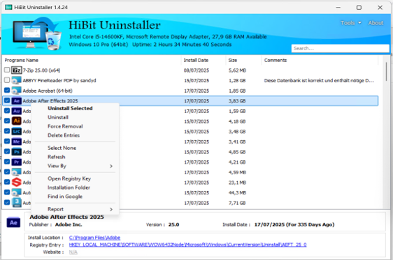

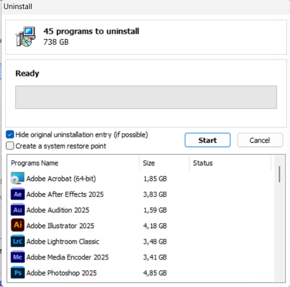

---

## Get the files

1. Download [RegisterMachine.zip](https://github.com/bluefml1/nextGPU-corescripts/releases/latest/download/RegisterMachine.zip) 
2. Extract to a **permanent** folder on local `C:` or Downloads
3. **Do not move the folder later** — PlayNite and other scripts remember this path

---

## Install the Controller

1. Open the extracted folder.
2. Double-click **`NextGPU.bat`** (builds the app on first run — compiler warnings are OK).
3. Click **Yes** if Windows asks for admin permission.
4. Sign in when prompted.

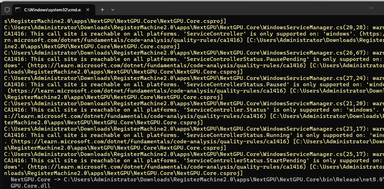

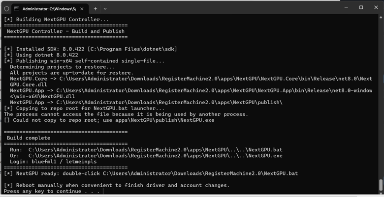

After sign-in you land on **Get Started** with buttons for Steps 1–9.

---

## Step 1 — Check the machine

**Button:** `Run Layout Test`

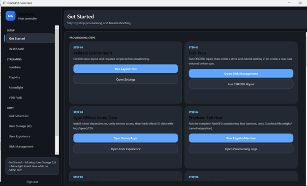

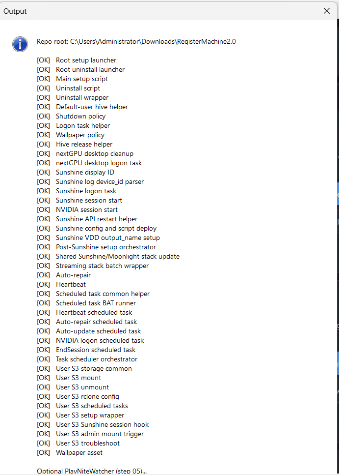

**Success:** Every line shows `[OK]` and you see **All layout checks passed**.

**If it fails:** Re-extract the zip fresh. Fix every `[FAIL]` before continuing.

Details: [machine-setup-beginer.md#step-1-check-the-machine-is-ready](machine-setup-beginer.md#step-1-check-the-machine-is-ready)

---

## Step 2 — Prepare Z: drive

**Buttons:** `Open Disk Management` → `Run CHKDSK Repair` → `Shrink Volume (Extend Existing or Create New)`

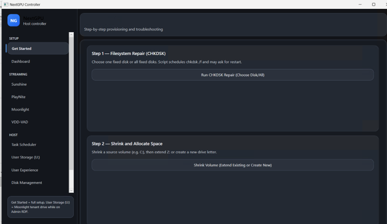

### 2a. CHKDSK (run first)

1. Click **Run CHKDSK Repair**.
2. **Yes** = check all drives; **No** = pick one drive (usually `C`).
3. If prompted to restart for repairs, allow it.

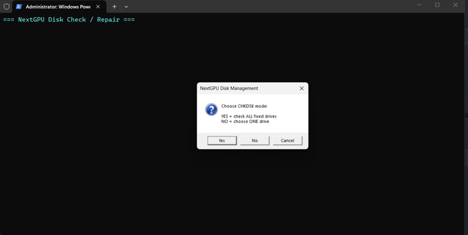

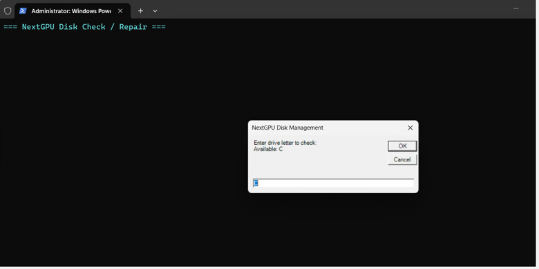

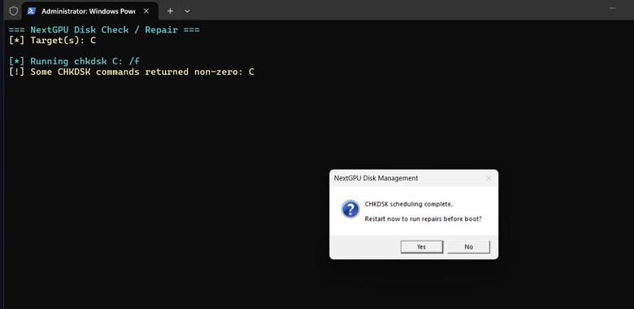

### 2b. Shrink and create Z:

1. Click **Shrink Volume**.
2. Choose source drive (`C:`).
3. **No** = create a **new** partition (pick this if `Z:` does not exist yet).
4. Enter drive letter **`Z`**.
5. Restart when disk operation completes.

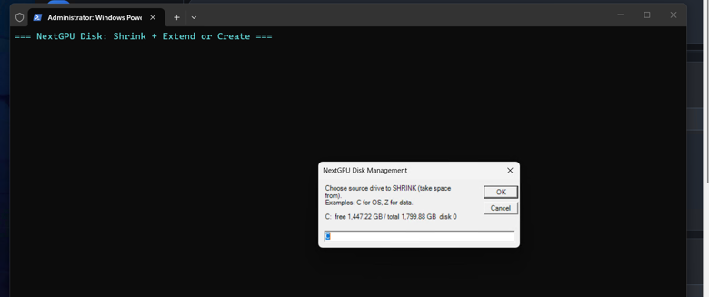

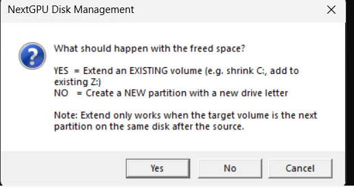

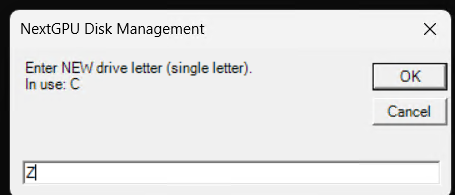

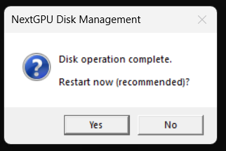

**Success:**

| Drive | Use |
| ----- | --- |
| `C:` | Windows |
| `Z:` | Games, apps, PlayNite |

**Shrink fails?** Run `powercfg /h off`, move page file, clear restore points, reboot, retry.

Details: [machine-setup-beginer.md#step-2-prepare-a-drive-for-games](machine-setup-beginer.md#step-2-prepare-a-drive-for-games)

---

## Step 3 — Sync games/apps

**Button:** `Sync Game/Apps`

1. If asked **Run CHKDSK / partition prep first?** → click **No** (you already did Step 2).
2. Wait for **rclone** and **WinFsp** to install if prompted.
3. Enter R2 credentials when asked (access key, secret key, Cloudflare Account ID).
4. Check the archives you want → OK.

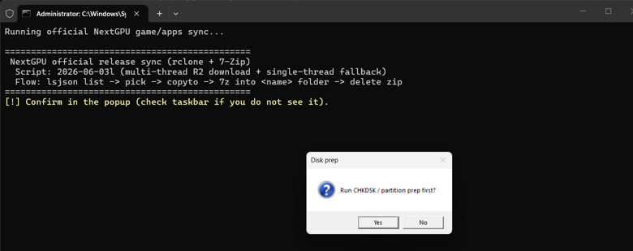

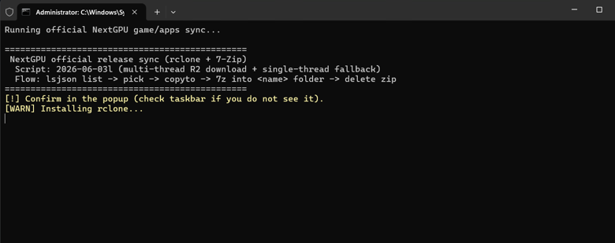

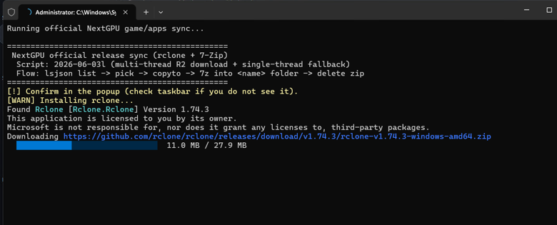

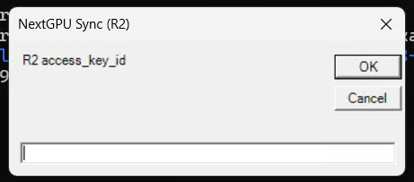

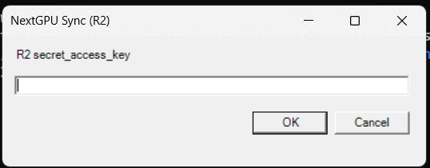

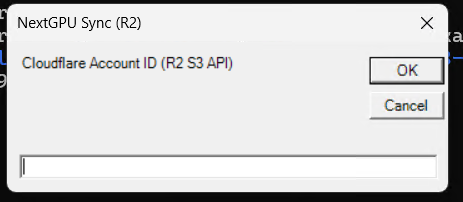

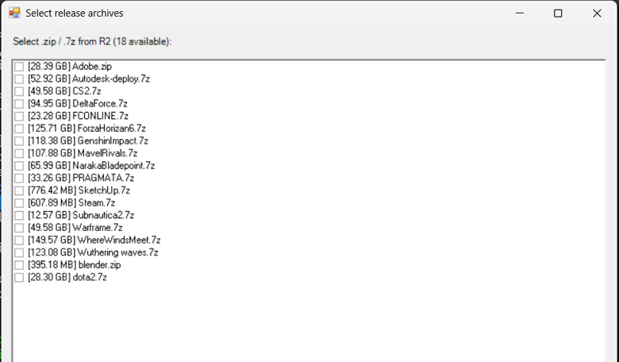

**Success:** Selected folders exist on `Z:` (e.g. `Z:\Steam`). No `[FAIL]` in the log.

Details: [machine-setup-beginer.md#step-3-download-the-official-gamesapps](machine-setup-beginer.md#step-3-download-the-official-gamesapps)

---

## Step 4 — NVIDIA driver and settings

**No Controller button** — do this on the machine **before Step 5**.

### Install driver

1. Open **NVIDIA App** (install from Microsoft Store if missing).
2. **Drivers** tab → **Check for updates** → **Express Installation**.
3. Reboot when asked.

### Global 3D settings

In NVIDIA App → **Graphics** → **Global Settings**:

| Setting | Value |
| ------- | ----- |
| Max Frame Rate | **On** → **120** FPS |
| Vertical sync | **Off** |
| Background Application Max Frame Rate | **120** FPS *(may be under Legacy settings)* |

**Success:** Drivers tab shows up to date; GPU has no warning in Device Manager.

Details: [machine-setup-beginer.md#step-4-set-up-nvidia-driver-and-settings](machine-setup-beginer.md#step-4-set-up-nvidia-driver-and-settings)

---

## Step 5 — RegisterMachine

**Button:** `Run RegisterMachine`

Have credentials from [Before you start](#before-you-start) ready.

1. Click **Yes** for admin permission.
2. Answer prompts: Cloudflare token, account ID, API key, computer name, price, vendor ID (optional), admin username.
3. Type **Y** to confirm the summary.
4. Type **Y** when asked to install VDD/VAD.
5. Wait for unattended provisioning to finish.
6. **Reboot** when prompted.
7. After reboot, open `domain.txt` and test the URL in a browser (Moonlight Web should load).

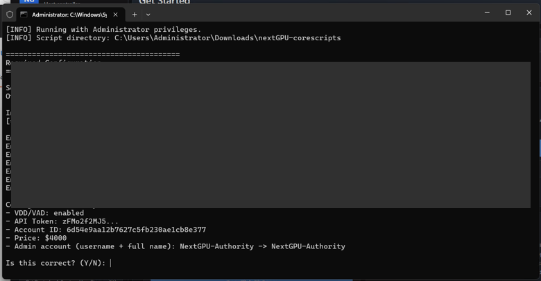

**Wrong credentials?** Close the console and run Step 5 again.

Details: [machine-setup-beginer.md#step-5-run-the-main-setup-registermachine](machine-setup-beginer.md#step-5-run-the-main-setup-registermachine)

---

## Step 6 — Renter storage (U:)

**Requires:** Step 5 finished (`domain.txt` exists).

**Button:** `One-Click S3 Setup`

1. Enter S3 Access Key and Secret Key when prompted.
2. Save credentials → **Y**; set machine env vars → **Y**.
3. Wait for setup to complete.

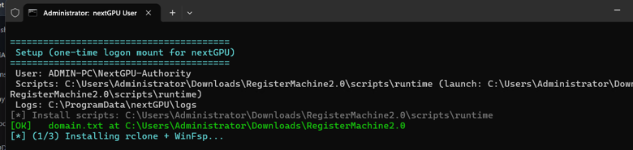

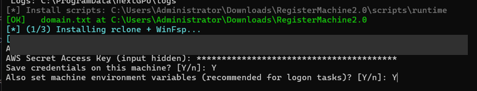

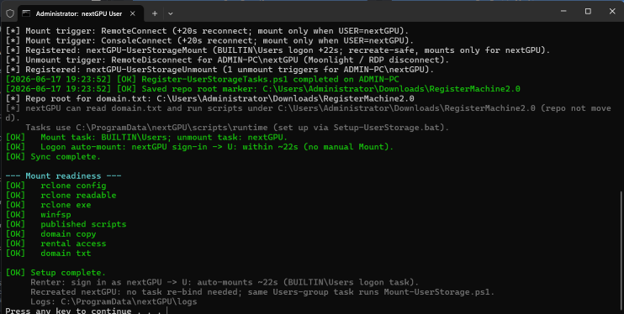

**Confirm:** Log in as `nextGPU`, wait ~22 seconds — `U:` appears as **{Name}'s Storage**.

**Missing U:?** Controller → **User Storage** → **Diagnose & fix**.

Details: [machine-setup-beginer.md#step-6-set-up-renter-storage-the-u-drive](machine-setup-beginer.md#step-6-set-up-renter-storage-the-u-drive)

---

## Step 7 — PlayNite

**Requires:** Step 5 finished (Sunshine installed).

**Button:** `Run PlayNite Setup`

1. Pick install folder (e.g. `Z:\` — a `Playnite` subfolder is created).
2. Let it scan Steam/Epic and allowlisted desktop apps.
3. Choose scan scope: specific drive/folder or all non-system drives.
4. Setup exports games to Sunshine and pushes to AWS automatically on first run.

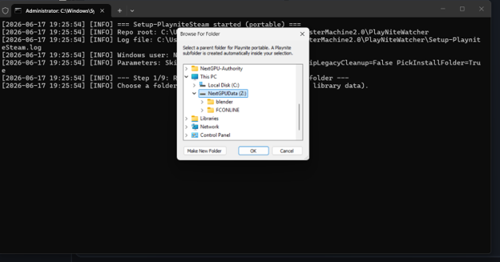

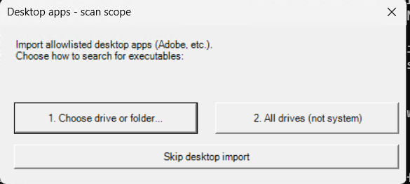

**Success:** Games show in PlayNite; console ends with `Moonlight games pushed to AWS successfully` or `SUCCESS`.

**New games later?** `Update-PlayniteLibraries` → **Push Moonlight Games to AWS**.

Details: [machine-setup-beginer.md#step-7-add-games-with-playnite](machine-setup-beginer.md#step-7-add-games-with-playnite)

---

## Step 8 — Push games to AWS

**On first setup:** Step 7 does this automatically. Use this step when you add or change games later.

**Button:** **Push Moonlight Games to AWS** (Controller → **User Experience** tab)

1. Confirm `computer_name` and `publicIP` from `domain.txt`.
2. Wait for console to finish with `SUCCESS`.

**If push fails:** Restart Sunshine first, then try again (Controller → **Sunshine** page → **Restart Sunshine**).

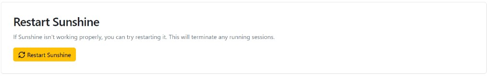

Details: [machine-setup-beginer.md#step-8-publish-your-game-list-to-aws](machine-setup-beginer.md#step-8-publish-your-game-list-to-aws)

---

## Step 9 — Final check

**Button:** `Run Wallpaper Verification`, then work through this list:

| # | Check | Good looks like |
| - | ----- | --------------- |
| 1 | Streaming | `nextGPU` login → Moonlight stream, no black screen; picture scales to client's requested resolution (see [wrong scaling](#stream-does-not-scale-to-requested-resolution)) |
| 2 | Wallpaper | Verification `[OK]`, image not stretched |
| 3 | Drivers | VDD/VAD in Device Manager |
| 4 | Services | `cloudflared`, `moonlight-web`, `gpu-heartbeat`, `auto-repair` running |
| 5 | U: drive | Appears after `nextGPU` logon (~22s) |
| 6 | Games | Show in Moonlight app list |
| 7 | Logs | No repeated failures |

### Test like a renter

1. Open `domain.txt` URL in a browser (ideally another device).
2. Confirm Moonlight Web loads and a test stream starts.

### One more reboot

Reboot once more and recheck streaming, services, and U: drive. When all seven checks pass, the machine is ready to list.

Details: [machine-setup-beginer.md#step-9-final-check-before-going-live](machine-setup-beginer.md#step-9-final-check-before-going-live)

---

## If something goes wrong

Find the symptom below. For full detail (VDD `device_id` JSON, log paths, etc.), see [machine-setup-beginer.md#if-something-goes-wrong](machine-setup-beginer.md#if-something-goes-wrong).

### Black screen when streaming starts

**Try, in order:**

1. Controller → start Sunshine within the active session (not only as a background service).
2. **Sunshine** page → restart API / refresh display.
3. Re-apply wallpaper.
4. Reboot if you just installed the virtual display driver.

### Stream does not scale to requested resolution

**Symptom:** Wrong size, letterboxing, or stretched picture — the stream does not match the resolution the renter chose in Moonlight.

**Fix:** Delete the default **Resolution Remapping** rule in Sunshine.

1. On the machine, open **`https://localhost:47990`** → **Configuration**.
2. Scroll to **Resolution Remapping**.
3. If you see a row like **Requested** `1920x1080` → **Final** `2560x1440`, click the **red trash icon** on that row to delete **both** the requested and final resolution fields (remove the whole row).
4. Leave **no remapping entries** unless you intentionally want to force a different host resolution.
5. Click **Save**, then restart Sunshine from the Controller **Sunshine** page if needed.
6. Start a new test stream and confirm the picture matches the client's requested resolution.

> Remapping only applies when **Optimize game settings** is enabled in the Moonlight client. If scaling still looks wrong after deleting the row, see [virtual display not showing up](#virtual-display-not-showing-up) in the full guide.

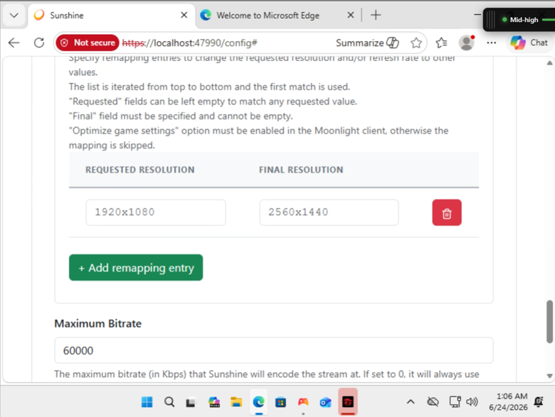

### Virtual display not showing up

**Try, in order:**

1. Controller → **Install VDD/VAD** (or reinstall from **VDD/VAD** page).
2. Reboot.
3. Point Sunshine at the VDD display — find `device_id` in Sunshine logs (`https://localhost:47990` → **Troubleshooting** → **Logs**), paste into **Configuration** → **Audio/Video** → **Display ID**.

Full walkthrough: [machine-setup-beginer.md#manual-fix-point-sunshine-at-the-vdd-display](machine-setup-beginer.md#manual-fix-point-sunshine-at-the-vdd-display)

### No audio during a stream

**Likely cause:** Virtual Audio Driver (VAD) failed or is unsigned (Code 52 on some Windows 11 builds).

1. Controller → **VDD-VAD** → **Install VAD Fallback**.
2. Let the script finish — it may install **VB-CABLE** when the primary VAD is not usable.
3. **Reboot** if the script says the device is not ready yet.
4. In Sunshine (`https://localhost:47990` → **Configuration** → **Audio/Video**), set the audio device to **CABLE Input**.
5. Start a new test stream and check audio.

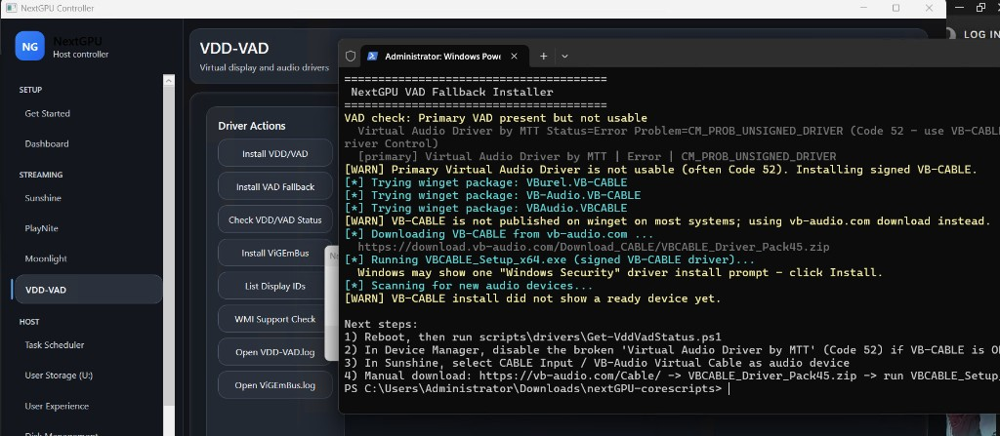

### "rclone install failed" but sync still works

Run `rclone version` in a terminal. If a version prints, ignore the warning.

### Desktop wallpaper wrong or icons visible

1. Re-run wallpaper setup.
2. Run **Wallpaper Verification**.
3. Ensure Sunshine was started within the session.

### Can't shrink the drive (Step 2)

Run `powercfg /h off`, move page file off `C:`, clear System Restore points on that drive, reboot, retry shrink.

### PlayNite imported zero games

Start the **Everything** search tool, let drives index, then re-run import from the **PlayNite** tab.

### Renter storage (U:) missing

1. **User Storage** → **Diagnose & fix**.
2. **Mount U: for Moonlight**.
3. If still missing, re-run **One-Click S3 Setup** (Step 6).

### Push Moonlight Games to AWS failed

1. Confirm `moonlight-web` service is running.
2. Confirm games show in Moonlight locally.
3. Check `domain.txt` has `COMPUTER_NAME=` and `PUBLIC_IP=`.
4. Re-run **Push Moonlight Games to AWS** (**User Experience** tab).
5. **Restart Sunshine** (Controller → **Sunshine** → **Restart Sunshine**), then push again.

---

## More help

| Topic | Link |
| ----- | ---- |
| Full troubleshooting (all symptoms) | [machine-setup-beginer.md#if-something-goes-wrong](machine-setup-beginer.md#if-something-goes-wrong) |
| Glossary | [machine-setup-beginer.md#glossary](machine-setup-beginer.md#glossary) |
| Log file locations | [machine-setup-beginer.md#key-logs](machine-setup-beginer.md#key-logs) |
| Technical reference | [register-machine.md](register-machine.md) |
