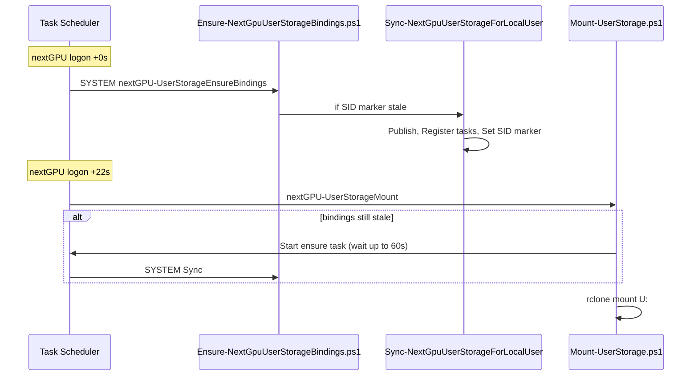

# nextGPU recreate → U: mount (reviewer notes)

## Intended flow (no auto-repair dependency)



## Key files

| File | Role |
|------|------|
| `UserStorageCommon.ps1` | `Test-NextGpuUserStorageBindingsCurrent`, `Wait-NextGpuUserStorageBindingsForMount`, `Sync-NextGpuUserStorageForLocalUser` |
| `Ensure-NextGpuUserStorageBindings.ps1` | SYSTEM-only repair: calls Sync (not auto-repair) |
| `Mount-UserStorage.ps1` | Waits on ensure when stale; mounts U: |
| `Register-UserStorageTasks.ps1` | `Register-AllNextGpuUserStorageTasks` (in-process from Sync) |

## Preconditions on a live host

1. Run **`User-Storage.bat Sync`** (or `Sync-NextGpuUserStorageForLocalUser.bat`) from **repo** `scripts\runtime` after every deploy.
2. Publishes scripts + applies **`Set-NextGpuRentalUserStorageAccess`** for `COMPUTER\nextGPU` (works after recreate — principal name, new SID).
3. `Test-NextGpuUserStorageRecreateReadiness.ps1` must pass before testing recreate.

## What nextGPU can access (after Sync / Ensure)

| Path | Access |
|------|--------|
| `%ProgramData%\nextGPU\scripts\runtime\` | Read + run (`User-Storage.bat`, mount scripts) |
| `%ProgramData%\nextGPU\rclone\rclone.conf` | Read |
| `%ProgramData%\nextGPU\logs\` | Write (mount/ensure logs) |
| `%ProgramData%\nextGPU\repo-root.txt` | Read |
| Repo `domain.txt` + `scripts\runtime` | Read (if setup granted repo ACLs) |
| `%LOCALAPPDATA%\nextGPU\logs\` | Write (fallback if ProgramData logs blocked) |

## Verification commands (Windows)

```bat
cd /d <repo>\scripts\runtime
Test-NextGpuUserStorageRecreateReadiness.bat
```

If you must call PowerShell directly (policy blocks `-File` without Bypass):

```bat
powershell -NoProfile -ExecutionPolicy Bypass -File Test-NextGpuUserStorageRecreateReadiness.ps1
```

After recreate + Moonlight logon as nextGPU:

```bat
powershell -ExecutionPolicy Bypass -File Test-UserStorageMount.ps1
type %ProgramData%\nextGPU\logs\user-storage-ensure.log
type %ProgramData%\nextGPU\logs\user-storage-mount.log
```

Success signals in logs:

- ensure: `Bindings repaired.`
- mount: `User storage mounted on U:`

## Known limits

- Cannot be fully validated on non-Windows CI; logic depends on `Get-LocalUser`, Task Scheduler, WinFsp, rclone.
- `Start-ScheduledTask` on the ensure task from **nextGPU** may fail; normal logon still triggers ensure at +0s before mount at +22s.
- Stale **task delays** (15s mount / 5s ensure) persist until **Sync** re-registers tasks.
